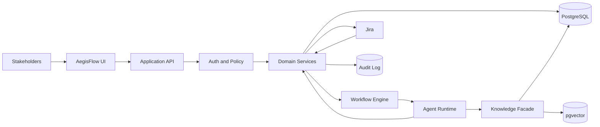
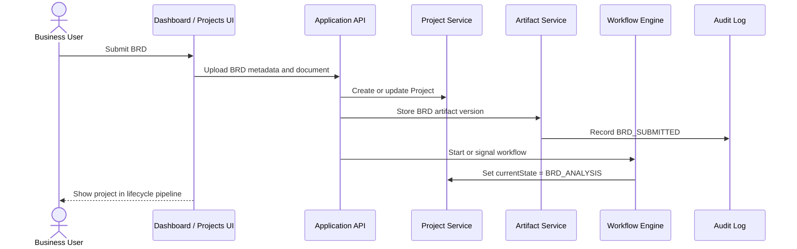
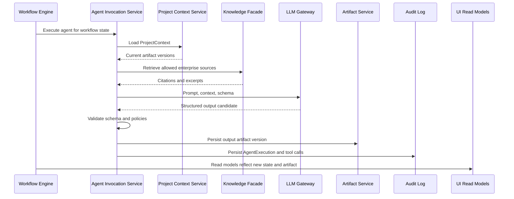
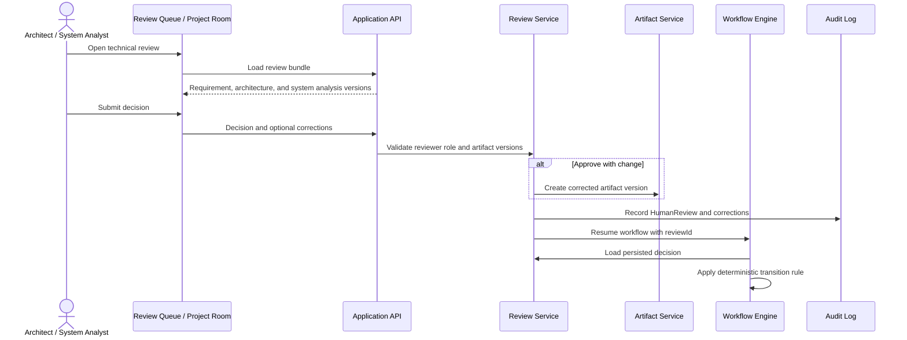
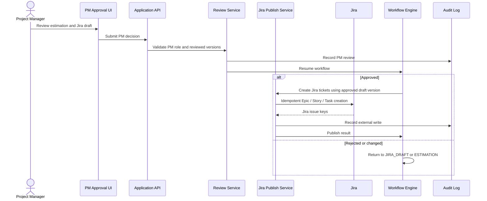
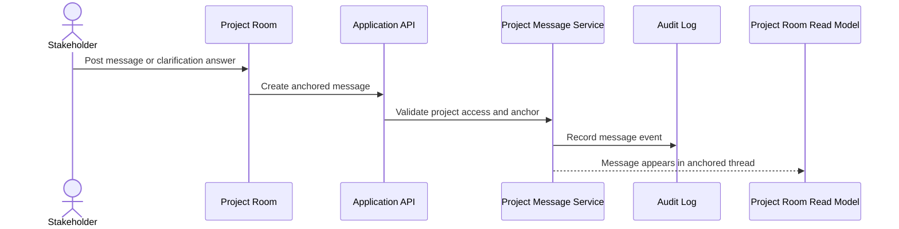
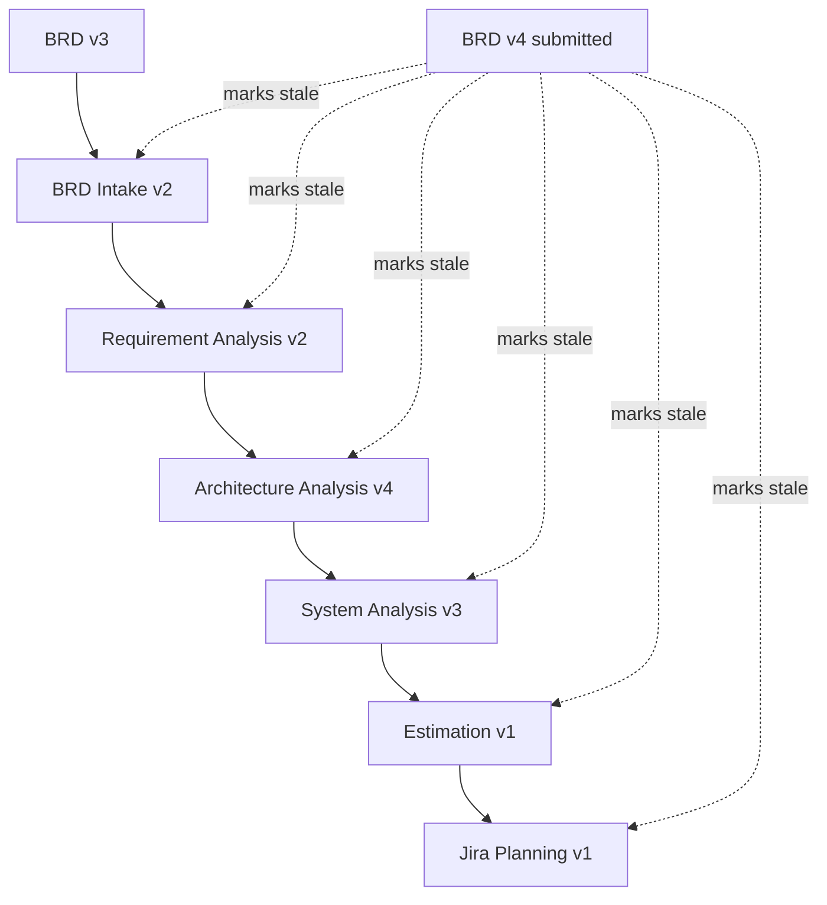
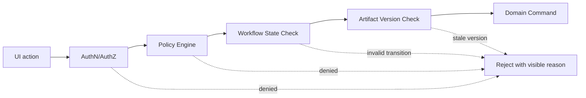

# AegisFlow Control Panel Data Flow

## Purpose

This document explains how data moves through the AegisFlow application interface represented in `design/aegis.pen`.

The UI is designed as a single source of truth and communication channel for stakeholders. It does not treat chat, agent responses, or screen-local state as authoritative. Every visible state in the interface comes from persisted project, workflow, artifact, review, agent execution, knowledge, integration, and audit records.

For detailed button, link, row, filter, approval, and export behavior, see `design/control-panel-interactions.md`.

## UI Screens Covered

| Pencil Frame | Menu Item | Primary Data Question |
|---|---|---|
| `App Screen 01 - Portfolio Control Panel` | Dashboard | What needs attention across the portfolio? |
| `App Screen 05 - Projects` | Projects | What is the status of every initiative? |
| `App Screen 06 - Review Queue` | Review Queue | What decisions do I personally need to make? |
| `App Screen 02 - Project Command Room` | Project Rooms | What is true for this project and what is the current decision point? |
| `App Screen 03 - PM Approval and Jira Draft` | Jira Drafts | Is the plan ready to publish to Jira? |
| `App Screen 07 - Agent Runs` | Agent Runs | How are agents performing across projects? |
| `App Screen 04 - Agent Execution Detail` | Agent Run Detail | Why did this agent produce this output? |
| `App Screen 08 - Knowledge` | Knowledge | Which enterprise sources are available and trusted? |
| `App Screen 09 - Audit` | Audit | What happened, who did it, and what changed? |

## Canonical Data Sources

The interface reads from these authoritative data areas:

| Data Area | Purpose | Example UI Usage |
|---|---|---|
| `Project` | Project identity, owner, tenant, status | Projects list, project header |
| `WorkflowInstance` | Current lifecycle state and pending wait state | Dashboard pipeline, project command room |
| `ProjectContext` | Canonical context snapshot for agents and reviewers | Project room, review bundle |
| `ArtifactVersion` | Immutable BRD, analysis, estimation, and Jira draft versions | Artifact ledger, review workspace |
| `ArtifactDependency` | Staleness and lineage between artifacts | Stale artifact warnings |
| `AgentExecution` | Agent run metadata, output, cost, confidence, traces | Agent runs, execution detail |
| `SourceCitation` | Enterprise knowledge used by agents | Agent detail, knowledge evidence |
| `HumanReview` | Approval gate, reviewer, decision, reviewed versions | Review queue, project room, PM approval |
| `HumanCorrection` | Corrected output and evaluation data | Review workspace, agent evaluation |
| `JiraPublishResult` | Created Jira keys and publish status | Jira draft and project room |
| `AuditLog` | Append-only trace of actions and state changes | Audit screen |
| `KnowledgeDocument` / `KnowledgeChunk` | Searchable enterprise knowledge | Knowledge screen, agent evidence |

## High-Level Data Flow



## Screen-Level Read Models

The UI should not query raw tables directly. Each major screen should use a purpose-built read model assembled by the backend.

### Dashboard Read Model

Used by `App Screen 01 - Portfolio Control Panel`.

```yaml
dashboard:
  activeProjectCount: 18
  technicalReviewCount: 4
  pmApprovalCount: 3
  monthlyAgentCost: 428
  lifecycleCounts:
    BRD_SUBMITTED: 2
    BRD_ANALYSIS: 1
    REQUIREMENT_ANALYSIS: 3
    ARCHITECTURE_ANALYSIS: 2
    SYSTEM_ANALYSIS: 1
    HUMAN_TECHNICAL_REVIEW: 4
    ESTIMATION: 1
    JIRA_DRAFT: 2
    HUMAN_PM_APPROVAL: 3
    JIRA_CREATED: 0
  myReviewQueue:
    - reviewId: rev-001
      projectId: PRJ-001
      gate: TECHNICAL_REVIEW
      waitingAge: 2d 4h
  projectRoomActivity:
    - messageId: msg-001
      projectId: PRJ-001
      anchorType: ARTIFACT_VERSION
      anchorId: architecture-v4
```

Data sources:

- `projects`
- `workflow_instances`
- `human_reviews`
- `agent_executions`
- `project_messages`
- `jira_publish_results`

### Projects Read Model

Used by `App Screen 05 - Projects`.

```yaml
projects:
  filters:
    state: ALL
    owner: ANY
    risk: ANY
  rows:
    - projectId: PRJ-001
      projectName: Dynamic QRIS Payment
      currentState: HUMAN_TECHNICAL_REVIEW
      owner: Nadia
      risk: HIGH
      brdVersion: 3
      latestArtifactVersions:
        architecture: 4
        systemAnalysis: 3
      updatedAt: 2026-09-13T10:00:00+07:00
```

Data sources:

- `projects`
- `workflow_instances`
- `artifact_versions`
- `human_reviews`

### Review Queue Read Model

Used by `App Screen 06 - Review Queue`.

```yaml
reviewQueue:
  reviewerId: user-architect-001
  role: DIGITAL_ARCHITECT
  pendingReviews:
    - reviewId: rev-001
      projectId: PRJ-001
      projectName: Dynamic QRIS Payment
      gate: TECHNICAL_REVIEW
      status: PENDING
      reviewedArtifactVersions:
        requirementAnalysis: 2
        architecture: 4
        systemAnalysis: 3
      waitingAge: 2d 4h
      riskFlags:
        - PAYMENT
        - PII_REVIEW_REQUIRED
```

Data sources:

- `human_reviews`
- `projects`
- `workflow_instances`
- `artifact_versions`
- `agent_executions`

### Project Command Room Read Model

Used by `App Screen 02 - Project Command Room`.

```yaml
projectRoom:
  project:
    id: PRJ-001
    name: Dynamic QRIS Payment
    brdVersion: 3
    currentState: HUMAN_TECHNICAL_REVIEW
  artifactLedger:
    - artifactType: BRD
      version: 3
      status: ACCEPTED
    - artifactType: ARCHITECTURE_ANALYSIS
      version: 4
      status: IN_REVIEW
  pendingDecision:
    reviewId: rev-001
    gate: TECHNICAL_REVIEW
    allowedDecisions:
      - APPROVE
      - APPROVE_WITH_CHANGE
      - REQUEST_CLARIFICATION
      - REJECT
  reviewBundle:
    requirementIssues: 9
    blockingQuestions: 3
    architectureRisks: 5
    impactedSystems: 7
  communication:
    anchoredMessages:
      - anchorType: ARTIFACT_VERSION
        anchorId: architecture-v4
        body: Existing service found. Recommend reuse first.
```

Data sources:

- `projects`
- `workflow_instances`
- `artifact_versions`
- `human_reviews`
- `agent_executions`
- `source_citations`
- `project_messages`
- `audit_log`

### PM Approval And Jira Draft Read Model

Used by `App Screen 03 - PM Approval and Jira Draft`.

```yaml
pmApproval:
  projectId: PRJ-001
  reviewId: rev-002
  gate: PM_REVIEW
  estimation:
    version: 1
    disciplineEstimates:
      backend: 8-10 days
      frontendMobile: 3-4 days
      qa: 5-6 days
    unknowns:
      - Issuer timeout and reversal SLA
  jiraDraft:
    version: 1
    targetProject: PAY
    epic:
      title: Enable Dynamic QRIS Payment Processing
    stories:
      - title: Submit dynamic QRIS payment request
        points: 8
        tasks:
          - Backend task
          - QA task
```

Data sources:

- `artifact_versions`
- `human_reviews`
- `jira_mapping_policy`
- `jira_publish_results`

### Agent Runs Read Model

Used by `App Screen 07 - Agent Runs`.

```yaml
agentRuns:
  summary:
    successRate: 94.2
    invalidOutputCount: 11
    averageLatency: 1m 42s
    monthlyCost: 428
  rows:
    - executionId: exec-001
      agentName: Architecture Agent
      workflowState: ARCHITECTURE_ANALYSIS
      status: SUCCEEDED
      cost: 0.42
      humanOutcome: PENDING
```

Data sources:

- `agent_executions`
- `human_reviews`
- `human_corrections`
- `artifact_versions`

### Agent Execution Detail Read Model

Used by `App Screen 04 - Agent Execution Detail`.

```yaml
agentExecutionDetail:
  executionId: exec-001
  projectId: PRJ-001
  agentName: Architecture Agent
  promptVersion: architecture-agent@2026.09.12
  model: gpt-5
  inputArtifactVersions:
    brd: 3
    requirementAnalysis: 2
  outputArtifactVersion:
    artifactType: ARCHITECTURE_ANALYSIS
    version: 4
  sources:
    - sourceType: Service Catalog
      authority: AUTHORITATIVE
      sourceId: svc-catalog-payment-orchestration
  toolCalls:
    - toolName: serviceCatalog.search
      status: SUCCEEDED
  tokenUsage:
    inputTokens: 12000
    outputTokens: 2600
  cost:
    amount: 0.42
    currency: USD
```

Data sources:

- `agent_executions`
- `artifact_versions`
- `source_citations`
- `tool_calls`
- `human_reviews`
- `human_corrections`

### Knowledge Read Model

Used by `App Screen 08 - Knowledge`.

```yaml
knowledge:
  sources:
    - sourceType: Architecture Standards
      authority: AUTHORITATIVE
      freshness: FRESH
      documentCount: 12
    - sourceType: Previous Projects
      authority: SUPPORTING
      freshness: STALE
      documentCount: 42
  retrievalPolicies:
    - agentName: Architecture Agent
      rules:
        - Must query service catalog before proposing new service.
        - Must cite architecture standards for integration pattern.
```

Data sources:

- `knowledge_documents`
- `knowledge_chunks`
- `knowledge_source_registry`
- `retrieval_policies`
- `agent_executions`

### Audit Read Model

Used by `App Screen 09 - Audit`.

```yaml
audit:
  events:
    - eventId: aud-001
      projectId: PRJ-001
      actorType: HUMAN
      actorId: user-pm-001
      action: HUMAN_REVIEW_SUBMITTED
      entityType: HUMAN_REVIEW
      entityId: rev-002
      timestamp: 2026-09-13T11:04:00+07:00
    - eventId: aud-002
      actorType: AGENT
      actorId: exec-001
      action: ARTIFACT_VERSION_CREATED
      entityType: ARTIFACT_VERSION
      entityId: architecture-v4
```

Data sources:

- `audit_log`
- `artifact_versions`
- `human_reviews`
- `agent_executions`
- `jira_publish_results`

## Primary User Action Flows

### 1. Submit BRD From Dashboard Or Projects



Authoritative write:

- `projects`
- `artifact_versions`
- `workflow_instances`
- `audit_log`

UI refresh impact:

- Dashboard active project count changes.
- Projects table shows new or updated project.
- Project Command Room artifact ledger shows new BRD version.

### 2. Agent Produces Analysis Artifact



Authoritative write:

- `agent_executions`
- `artifact_versions`
- `source_citations`
- `tool_calls`
- `audit_log`

UI refresh impact:

- Project Command Room artifact ledger updates.
- Agent Runs list gets a new execution.
- Agent Execution Detail becomes available.
- Knowledge source usage is reflected in Knowledge and Audit screens.

### 3. Technical Review Decision



Decision-to-state mapping:

| Decision | Result |
|---|---|
| `APPROVE` | Continue to `ESTIMATION` |
| `APPROVE_WITH_CHANGE` | Create corrected versions, then continue to `ESTIMATION` |
| `REQUEST_CLARIFICATION` | Return to `REQUIREMENT_ANALYSIS` or `BRD_SUBMITTED` |
| `REJECT` | Return to earlier state or terminate according to policy |

Authoritative write:

- `human_reviews`
- `human_corrections`
- `artifact_versions` when corrected
- `workflow_instances`
- `audit_log`

UI refresh impact:

- Review Queue removes or updates the item.
- Dashboard review count changes.
- Project Command Room moves to next state or earlier state.
- Agent Execution Detail links human outcome and correction.

### 4. PM Approval And Jira Creation



Authoritative write:

- `human_reviews`
- `human_corrections`
- `jira_publish_results`
- `workflow_instances`
- `audit_log`

UI refresh impact:

- Jira Draft screen shows ticket keys or returned draft state.
- Dashboard Jira readiness count changes.
- Audit shows external write provenance.

### 5. Stakeholder Communication



Important rule:

Comments and messages are communication artifacts. They can answer clarification questions or support a decision, but they do not change workflow state unless submitted through an explicit workflow action such as a review decision or BRD revision.

Message anchors:

- Project.
- Artifact version.
- Finding.
- Clarification question.
- Human review.
- Jira draft item.
- Agent execution.

## Lifecycle State Drives The UI

The workflow state determines which controls are visible and which actions are allowed.

| Workflow State | UI Surface | Primary Action |
|---|---|---|
| `BRD_SUBMITTED` | Projects / Project Room | Start BRD analysis |
| `BRD_ANALYSIS` | Project Room | Monitor intake result |
| `REQUIREMENT_ANALYSIS` | Project Room | Review gaps and questions |
| `ARCHITECTURE_ANALYSIS` | Project Room / Agent Runs | Inspect reuse recommendation |
| `SYSTEM_ANALYSIS` | Project Room | Inspect flows and contracts |
| `HUMAN_TECHNICAL_REVIEW` | Review Queue / Project Room | Approve, change, reject, or clarify |
| `ESTIMATION` | Project Room / Agent Runs | Inspect advisory estimate |
| `JIRA_DRAFT` | Jira Drafts | Inspect generated epic/story/task plan |
| `HUMAN_PM_APPROVAL` | PM Approval | Approve, change, or reject Jira draft |
| `JIRA_CREATED` | Projects / Project Room | View Jira issue keys |

## Data Freshness And Staleness

The UI must highlight stale data whenever an upstream artifact changes.



UI behavior:

- Stale reviews should show a disabled decision state.
- Stale artifacts remain visible for audit but cannot be approved.
- Project rows should show a stale artifact warning.
- Project Command Room should explain which upstream version caused staleness.

## Permission And Policy Data Flow

Every command from the UI must pass authorization and workflow-state checks.



Examples:

- A Business user can submit BRD revisions and answer clarification questions.
- A Digital Architect can approve technical review only for assigned projects.
- A Project Manager can approve Jira creation only after estimation and Jira draft exist.
- Agents cannot invoke UI commands and cannot bypass human approval gates.

## UI Events That Must Create Audit Records

| UI Action | Audit Action |
|---|---|
| Submit BRD | `BRD_SUBMITTED` |
| Upload BRD revision | `BRD_VERSION_CREATED` |
| Open review decision | `HUMAN_REVIEW_VIEWED` |
| Submit approval | `HUMAN_REVIEW_SUBMITTED` |
| Approve with change | `HUMAN_CORRECTION_CREATED` |
| Request clarification | `CLARIFICATION_REQUESTED` |
| Answer clarification | `CLARIFICATION_ANSWERED` |
| Create Jira tickets | `JIRA_ISSUES_CREATED` |
| View agent execution detail | `AGENT_EXECUTION_VIEWED` if required by audit policy |
| Export audit evidence | `AUDIT_EXPORT_CREATED` |

## Data Flow Risks

| Risk | UI Impact | Mitigation |
|---|---|---|
| Workflow state and database state diverge | Dashboard and project room disagree | Reconciliation job and single read model source |
| User approves stale artifact | Wrong Jira or estimation generated | Version lock and stale review invalidation |
| Agent confidence over-trusted | Human skips necessary review | Show confidence as evidence, not action authority |
| Communication treated as decision | Uncontrolled state change | Only structured decisions trigger workflow commands |
| Knowledge source stale | Wrong architecture recommendation | Freshness label and source authority display |
| Duplicate Jira creation | Duplicate tickets | Idempotency key and publish result lock |
| Missing audit context | Poor governance evidence | Audit every state-changing command |

## Recommended Backend API Shape

The UI can be supported by read endpoints and command endpoints:

```text
GET  /dashboard
GET  /projects
GET  /projects/{projectId}/room
GET  /reviews/my-queue
GET  /reviews/{reviewId}
POST /reviews/{reviewId}/decision
GET  /jira-drafts/{projectId}
POST /jira-drafts/{projectId}/approval
GET  /agent-runs
GET  /agent-runs/{executionId}
GET  /knowledge/sources
GET  /knowledge/policies
GET  /audit/events
POST /projects
POST /projects/{projectId}/brd-versions
POST /projects/{projectId}/messages
```

Command endpoints should return updated read model identifiers or workflow state summaries so the UI can refresh deterministically.

## Design Implication

The application interface should feel like a governed operational console:

- Dashboard summarizes portfolio truth.
- Projects lists lifecycle state and artifact health.
- Review Queue turns human gates into explicit work items.
- Project Command Room anchors communication to artifacts and decisions.
- PM Approval protects Jira creation.
- Agent Runs and Agent Execution Detail expose traceability.
- Knowledge shows source authority and freshness.
- Audit proves what happened.

The data flow reinforces the central rule of AegisFlow: AI may generate proposals, but only validated workflow rules and authorized human decisions can change enterprise state.
