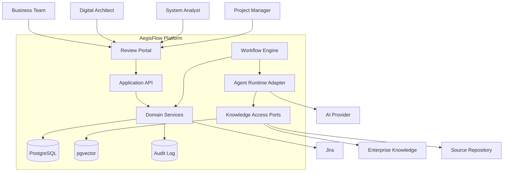
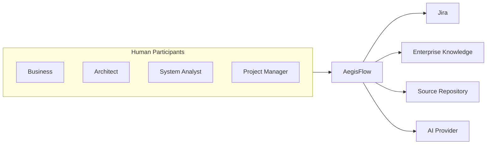

# AegisFlow Vision

## Purpose

AegisFlow is an enterprise AI-assisted SDLC orchestration platform. Its role is to move a software initiative from a submitted Business Requirement Document (BRD) to human-approved Jira delivery tickets while preserving governance, auditability, and deterministic control.

The platform is not an autonomous agent swarm. AegisFlow uses a workflow engine to decide what happens next, when humans must approve, which agent may run, what artifacts are valid, and how failures are handled. Agents reason and generate candidate artifacts; they do not own lifecycle state.

## Design Thesis

The core operating model is:

```text
Workflow Engine
      |
      +---- Agent
      |
      +---- Deterministic Service
      |
      +---- Human Approval
      |
      +---- External System
```

The workflow engine controls state transitions. Deterministic application services persist authoritative state. Agents are stateless workers from the perspective of the workflow and must operate only on explicit artifact versions from `ProjectContext`.

## Goals

- Reduce manual effort in BRD analysis, technical analysis, estimation, and Jira planning.
- Preserve human authority over technical approval and delivery commitment.
- Make every generated artifact traceable to inputs, prompt versions, model versions, knowledge sources, tool calls, and human corrections.
- Allow enterprise knowledge to be connected incrementally without redesigning the platform.
- Provide a foundation for future Development Agent, QA Agent, CI/CD, and UAT automation.

## Non-Goals

- No autonomous agent-to-agent loops.
- No automatic Jira creation before PM approval.
- No production code generation or deployment in the MVP.
- No QA, CI/CD, UAT, or development-agent execution in the MVP.
- No assumption that all enterprise knowledge systems are integrated on day one.

## High-Level Architecture



## System Context Diagram



## Architecture Principles

1. Workflow state is explicit, validated, and observable.
2. Agents produce proposed outputs, not authoritative decisions.
3. `ProjectContext` is the canonical input package for every agent run.
4. Artifact versions are immutable after publication.
5. Human decisions are first-class workflow events.
6. External writes are idempotent and approval-gated.
7. Knowledge sources are cited and scored for authority.
8. Confidence scores inform review priority, not automatic governance decisions.
9. Tool access is scoped per agent, project, tenant, and workflow state.
10. Cost and latency are measured per execution.

## Technology Position

Temporal is a strong candidate for durable workflow execution, retries, timers, signals, and human wait states. Current Temporal documentation emphasizes deterministic workflow code and recommends placing non-deterministic operations such as API calls, database queries, and AI invocations inside Activities.

OpenAI Agents SDK is useful as an agent runtime for structured outputs, tool calling, guardrails, and tracing. It should not be used as the lifecycle orchestrator. The workflow engine should decide which agent runs and what transition follows.

LangGraph is a capable agent graph runtime with persistence and human-in-the-loop interrupts. For AegisFlow MVP, it overlaps with Temporal and could blur the boundary between workflow orchestration and agent reasoning. It may be useful later inside a single complex agent, but it should not own enterprise lifecycle state.

PostgreSQL is appropriate as the authoritative business data store. pgvector is useful for retrieval when knowledge ingestion reaches MVP maturity, but it should start small and scoped.

Kafka is not required for the first MVP unless enterprise integration constraints demand asynchronous ingestion or event streaming. A transactional outbox table is simpler for initial integration events.

## Source Notes

- Temporal documentation: durable execution, workflow determinism, Activities, retries, Signals, Queries.
- OpenAI Agents SDK documentation: agents, tools, guardrails, human-in-the-loop, tracing.
- LangGraph documentation: stateful agent graphs, persistence, interrupts, resume.
- pgvector documentation: vector similarity search and HNSW/IVFFlat indexing.
