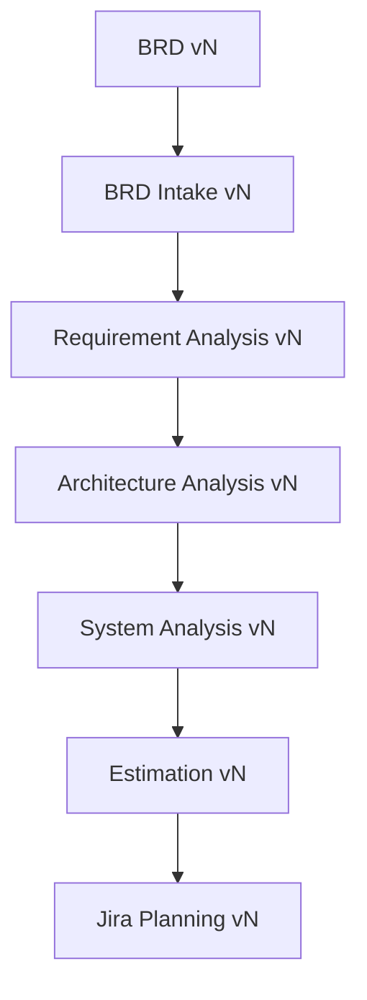
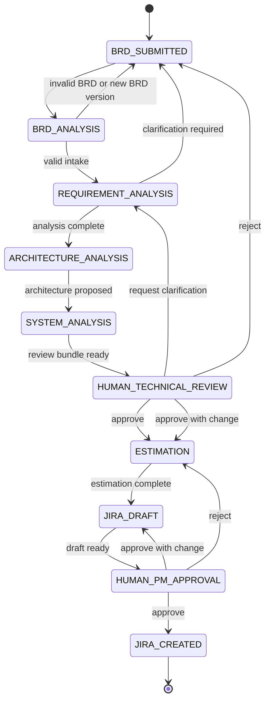

# Domain Model

## Core Concepts

AegisFlow separates workflow execution from business truth.

- `Project` represents the software initiative.
- `ProjectContext` is the canonical, versioned snapshot used by agents and reviewers.
- `Artifact` represents a domain output such as BRD extraction, requirement analysis, architecture analysis, system analysis, estimation, or Jira planning.
- `AgentExecution` records one auditable AI run.
- `HumanReview` records human decisions and corrections.
- `WorkflowInstance` records lifecycle execution state and correlates to the workflow engine.

Agents must never rely on chat history as source of record. They receive `ProjectContext` plus explicit artifact versions.

## ProjectContext Model

```yaml
project:
  id: PRJ-001
  tenantId: tenant-bank-001
  name: Dynamic QRIS Payment
  businessOwner: user-123
  status: ACTIVE
  createdAt: 2026-09-12T09:00:00+07:00
  updatedAt: 2026-09-12T10:00:00+07:00

workflow:
  instanceId: wf-001
  currentState: ARCHITECTURE_ANALYSIS
  stateEnteredAt: 2026-09-12T10:00:00+07:00
  blockedReason: null
  pendingReviewId: null

artifacts:
  brd:
    currentVersion: 3
    status: ACCEPTED_FOR_ANALYSIS
  brdIntake:
    currentVersion: 2
    status: GENERATED
  requirementAnalysis:
    currentVersion: 2
    status: GENERATED
  architecture:
    currentVersion: 4
    status: GENERATED
  systemAnalysis:
    currentVersion: 3
    status: GENERATED
  estimation:
    currentVersion: 1
    status: DRAFT
  jiraPlanning:
    currentVersion: 1
    status: DRAFT

knowledge:
  retrievalPolicyId: kp-architecture-mvp
  allowedSourceTypes:
    - ARCHITECTURE_STANDARD
    - API_CATALOG
    - SERVICE_CATALOG
    - ADR
  effectiveAt: 2026-09-12T10:00:00+07:00

governance:
  requiredApprovals:
    - TECHNICAL_REVIEW
    - PM_REVIEW
  riskLevel: MEDIUM
  regulatoryFlags:
    - PAYMENT
    - PII_REVIEW_REQUIRED
```

## Artifact Types

| Artifact | Producer | Human Gate | Authoritative After |
|---|---|---|---|
| BRD | Business user or source system | Business submission | Submitted version |
| BRD Intake | BRD Intake Agent | None by default | Validation succeeds |
| Requirement Analysis | Requirement Analyst Agent | Technical Review bundle | Technical approval |
| Architecture Analysis | Architecture Agent | Technical Review bundle | Technical approval |
| System Analysis | System Analyst Agent | Technical Review bundle | Technical approval |
| Estimation | Estimation Agent | PM Review bundle | PM approval |
| Jira Planning | Jira Planning Agent | PM Review bundle | PM approval |
| Jira Created | Jira integration service | N/A | Jira API success |

## Artifact Versioning Rules

- Artifact versions are immutable.
- A new version references its parent version and the execution or human action that produced it.
- Human corrections create a new artifact version, not an in-place edit.
- Agent executions record the exact input artifact versions.
- Approval applies to exact artifact versions, not an artifact type generally.
- When a source artifact changes, downstream artifacts become stale according to dependency rules.

## Artifact Dependency Graph



## Key Aggregates

### Project

Owns project identity, tenant, lifecycle status, and links to the active workflow.

### Artifact

Owns type, version, structured payload, validation result, provenance, hash, and status.

### Review

Owns reviewer role, decision, requested changes, corrected artifacts, decision timestamp, and workflow resume payload.

### AgentExecution

Owns execution metadata, inputs, outputs, traces, token/cost usage, model configuration, tool calls, sources, and quality signals.

## Lifecycle State Machine



## Answers To Domain Questions

1. Start as a modular monolith. The domain is still forming and the core transaction boundaries are shared.
2. The application database owns canonical lifecycle state; Temporal owns durable execution history and wake-up mechanics.
3. Long-running workflows survive restarts through Temporal workflow history and persisted `WorkflowInstance`/`ProjectContext`.
4. BRD version changes mark dependent artifacts stale and route the workflow to the earliest impacted state.
5. Agent outputs are immutable artifact versions linked to `AgentExecution`.
6. Agents know authoritative knowledge through retrieval policies, source rankings, freshness metadata, and citations.
7. Confidence scores prioritize review attention and escalation.
8. Confidence must not approve architecture, estimation, Jira creation, security exceptions, or external writes.
9. Workflow transitions accept only validated enum statuses from schemas, never free text.
10. Reproduction requires prompt version, model identifier, input versions, knowledge snapshot IDs, tool traces, and output hash.
11. Human corrections become labeled evaluation records linked to the original output and accepted correction.
12. Prompts are version-controlled alongside agent definitions and deployed through release metadata.
13. Infinite loops are prevented by fixed workflow states, max retries, explicit human gates, and no free agent-to-agent dispatch.
14. Token cost is controlled through model routing, context budgets, retrieval limits, caching, and per-project spend caps.
15. Development and QA Agents should attach after Jira planning as new workflow branches, not by replacing the governance spine.
