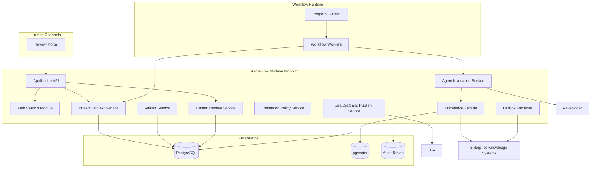
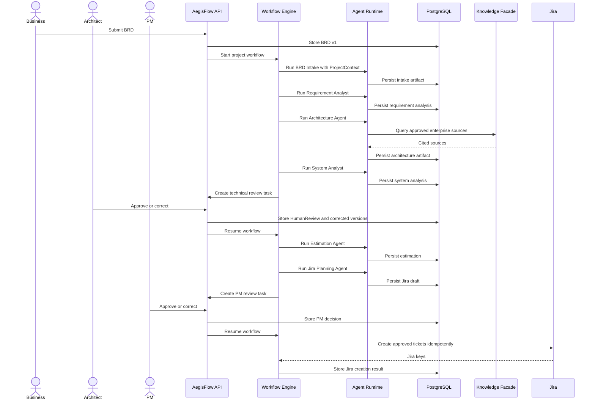

# Workflow Design

## Workflow Ownership

AegisFlow has two complementary state systems:

- Temporal or another durable workflow engine owns execution progress, timers, retries, pauses, and resume signals.
- PostgreSQL owns canonical business state, artifacts, approvals, audit records, and integration results.

This avoids making workflow history the only way to answer business questions while still gaining durable execution.

## MVP Lifecycle

```text
BRD_SUBMITTED
  -> BRD_ANALYSIS
  -> REQUIREMENT_ANALYSIS
  -> ARCHITECTURE_ANALYSIS
  -> SYSTEM_ANALYSIS
  -> HUMAN_TECHNICAL_REVIEW
  -> ESTIMATION
  -> JIRA_DRAFT
  -> HUMAN_PM_APPROVAL
  -> JIRA_CREATED
```

## Container Architecture



## Workflow Step Contract

Each workflow state must declare:

| Field | Meaning |
|---|---|
| `state` | Current lifecycle enum |
| `entryCriteria` | Required artifact versions and statuses |
| `executor` | Agent, deterministic service, human gate, or external integration |
| `input` | Validated payload or `ProjectContext` projection |
| `outputSchema` | JSON schema to validate result |
| `transitionRules` | Allowed next states based on structured output |
| `retryPolicy` | Retry count, backoff, timeout, non-retryable failures |
| `failurePath` | Wait, escalate, rollback, or return state |
| `auditRequirements` | Records that must be persisted before transition |

## State Responsibilities

| State | Executor | Output |
|---|---|---|
| `BRD_SUBMITTED` | Deterministic service | BRD artifact version accepted |
| `BRD_ANALYSIS` | BRD Intake Agent | Structured BRD extraction |
| `REQUIREMENT_ANALYSIS` | Requirement Analyst Agent | Completeness and clarification analysis |
| `ARCHITECTURE_ANALYSIS` | Architecture Agent | Proposed architecture and risks |
| `SYSTEM_ANALYSIS` | System Analyst Agent | API, data, event, and scenario analysis |
| `HUMAN_TECHNICAL_REVIEW` | Human approval | Approved, changed, rejected, or clarification decision |
| `ESTIMATION` | Estimation Agent | Advisory estimate |
| `JIRA_DRAFT` | Jira Planning Agent | Draft epic/story/task hierarchy |
| `HUMAN_PM_APPROVAL` | Human approval | Approved, changed, or rejected plan |
| `JIRA_CREATED` | Jira integration service | Jira ticket keys and publish result |

## BRD To Jira End-To-End Sequence



## Human Wait States

Human review states pause indefinitely until a valid decision is submitted. The workflow must store the pending review ID and expose it through the review portal. Resume signals include the decision ID, reviewed artifact versions, and correction version IDs.

## Idempotency

- Workflow start idempotency key: `tenantId + projectId + brdVersion`.
- Agent execution idempotency key: `projectId + workflowState + agentVersion + promptVersion + inputArtifactVersionHash`.
- Jira creation idempotency key: `projectId + jiraPlanningVersion + targetJiraProject`.
- Human decision idempotency key: `reviewId + reviewerId + submittedAtBucket`.

## Workflow Versioning

Workflow definitions must be versioned. Existing workflow instances should either complete on their original workflow version or pass through explicit migration states. Changes that reorder durable workflow commands require engine-specific versioning controls.

## Why Not Pure Database Polling?

Database polling is simpler but weaker for long wait states, retries, and operational visibility. A workflow engine gives durable timers, explicit waits, and retry semantics. The application database still remains the canonical project record.
