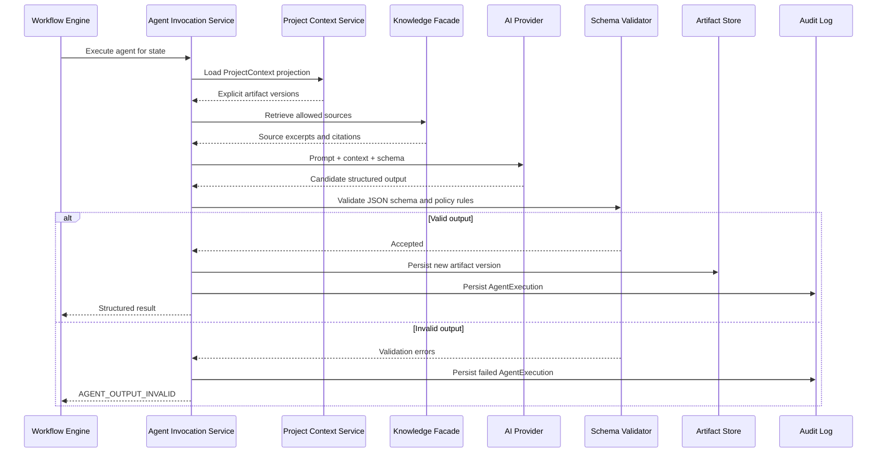

# Agent Architecture

## Boundary

Agents are specialized reasoning components invoked by workflow-controlled activities. They cannot decide workflow transitions directly, create Jira tickets, call arbitrary tools, or call each other recursively.

The workflow invokes:

```text
ProjectContext projection
  + artifact versions
  + retrieval policy
  + agent configuration
  + output schema
  -> Agent Runtime
  -> validated structured output
  -> artifact persistence
```

## Initial Agents

### BRD Intake Agent

Extracts structured requirements, actors, objectives, functional requirements, non-functional requirements, business rules, assumptions, dependencies, and missing information.

### Requirement Analyst Agent

Validates completeness, ambiguity, contradictions, missing requirements, clarification questions, acceptance criteria, and edge cases including TPS, SLA, timeout, retry, reconciliation, reversal, audit, security, availability, and compliance.

### Architecture Agent

Analyzes requirements against enterprise capability sources. It must investigate existing service, API, database, event, capability, and architecture pattern before proposing new components.

### System Analyst Agent

Produces detailed API interactions, sequence flows, data flows, error handling, API/event contracts, integration scenarios, functional scenarios, and system dependencies.

### Estimation Agent

Decomposes scope, estimates complexity, identifies disciplines, and highlights unknowns. The result is advisory only.

### Jira Planning Agent

Transforms approved analysis into Jira draft epics, stories, and tasks. It cannot publish Jira tickets.

## Agent Execution Sequence



## Common Agent Input Schema

```json
{
  "$schema": "https://json-schema.org/draft/2020-12/schema",
  "$id": "https://aegisflow.local/schemas/agent-input.json",
  "type": "object",
  "required": ["executionId", "projectContext", "task", "inputArtifactVersions", "constraints"],
  "properties": {
    "executionId": { "type": "string" },
    "projectContext": { "$ref": "#/$defs/projectContext" },
    "task": {
      "type": "object",
      "required": ["workflowState", "agentName", "expectedOutputSchemaId"],
      "properties": {
        "workflowState": { "type": "string" },
        "agentName": { "type": "string" },
        "expectedOutputSchemaId": { "type": "string" }
      }
    },
    "inputArtifactVersions": {
      "type": "array",
      "items": {
        "type": "object",
        "required": ["artifactType", "version", "hash"],
        "properties": {
          "artifactType": { "type": "string" },
          "version": { "type": "integer", "minimum": 1 },
          "hash": { "type": "string" }
        }
      }
    },
    "knowledgeSources": {
      "type": "array",
      "items": { "$ref": "#/$defs/knowledgeSource" }
    },
    "constraints": {
      "type": "object",
      "required": ["maxFindings", "mustCiteSources", "allowedToolIds"],
      "properties": {
        "maxFindings": { "type": "integer", "minimum": 1 },
        "mustCiteSources": { "type": "boolean" },
        "allowedToolIds": { "type": "array", "items": { "type": "string" } }
      }
    }
  },
  "$defs": {
    "projectContext": {
      "type": "object",
      "required": ["project", "workflow", "artifacts"],
      "properties": {
        "project": { "type": "object" },
        "workflow": { "type": "object" },
        "artifacts": { "type": "object" },
        "governance": { "type": "object" },
        "knowledge": { "type": "object" }
      }
    },
    "knowledgeSource": {
      "type": "object",
      "required": ["sourceId", "sourceType", "authority", "retrievedAt"],
      "properties": {
        "sourceId": { "type": "string" },
        "sourceType": { "type": "string" },
        "title": { "type": "string" },
        "authority": { "enum": ["AUTHORITATIVE", "SUPPORTING", "UNVERIFIED"] },
        "retrievedAt": { "type": "string", "format": "date-time" },
        "excerptRef": { "type": "string" }
      }
    }
  }
}
```

## Common Agent Output Envelope

```json
{
  "$schema": "https://json-schema.org/draft/2020-12/schema",
  "$id": "https://aegisflow.local/schemas/agent-output-envelope.json",
  "type": "object",
  "required": ["status", "confidence", "summary", "findings", "questions", "assumptions", "recommendations"],
  "properties": {
    "status": {
      "enum": ["COMPLETE", "NEED_CLARIFICATION", "BLOCKED", "INVALID_INPUT"]
    },
    "confidence": {
      "type": "number",
      "minimum": 0,
      "maximum": 1
    },
    "summary": { "type": "string", "maxLength": 4000 },
    "findings": {
      "type": "array",
      "items": { "$ref": "#/$defs/finding" }
    },
    "questions": {
      "type": "array",
      "items": { "$ref": "#/$defs/question" }
    },
    "assumptions": {
      "type": "array",
      "items": { "$ref": "#/$defs/assumption" }
    },
    "recommendations": {
      "type": "array",
      "items": { "$ref": "#/$defs/recommendation" }
    },
    "artifactPayload": { "type": "object" }
  },
  "$defs": {
    "finding": {
      "type": "object",
      "required": ["id", "severity", "description"],
      "properties": {
        "id": { "type": "string" },
        "severity": { "enum": ["LOW", "MEDIUM", "HIGH", "CRITICAL"] },
        "description": { "type": "string" },
        "sourceRefs": { "type": "array", "items": { "type": "string" } }
      }
    },
    "question": {
      "type": "object",
      "required": ["id", "question", "blocking"],
      "properties": {
        "id": { "type": "string" },
        "question": { "type": "string" },
        "blocking": { "type": "boolean" },
        "targetRole": { "type": "string" }
      }
    },
    "assumption": {
      "type": "object",
      "required": ["id", "statement", "risk"],
      "properties": {
        "id": { "type": "string" },
        "statement": { "type": "string" },
        "risk": { "enum": ["LOW", "MEDIUM", "HIGH"] }
      }
    },
    "recommendation": {
      "type": "object",
      "required": ["id", "description", "rationale"],
      "properties": {
        "id": { "type": "string" },
        "description": { "type": "string" },
        "rationale": { "type": "string" },
        "sourceRefs": { "type": "array", "items": { "type": "string" } }
      }
    }
  }
}
```

## Specialized Output Payloads

Each agent gets a specific `artifactPayload` schema. Examples:

- BRD Intake: actors, objectives, functional requirements, non-functional requirements, business rules, missing information.
- Requirement Analysis: completeness score, ambiguity list, contradictions, acceptance criteria, edge cases.
- Architecture Analysis: existing capability assessment, proposed components, integration pattern, data ownership, decisions, risks.
- System Analysis: APIs, events, sequence flows, data flows, error handling matrix, dependency matrix.
- Estimation: work breakdown, discipline estimates, complexity drivers, estimation assumptions.
- Jira Planning: epics, stories, tasks, acceptance criteria, labels, dependencies.

## Guardrails

Agent runtime must enforce:

- Input prompt-injection scanning.
- Output schema validation.
- Required source citation for architecture and system analysis.
- Tool allowlist by agent and workflow state.
- Token and latency budget per execution.
- Maximum retry count for invalid output.
- No direct workflow transition based on free text.

## Runtime Choice

OpenAI Agents SDK is suitable for agent execution because current official documentation describes built-in primitives for agents, tools, guardrails, human-in-the-loop, sessions, and tracing. AegisFlow should use it as an invocation/runtime layer only. The deterministic lifecycle remains in the workflow engine and domain services.

LangGraph should be deferred. It can be considered inside a future complex Development Agent or QA Agent where an internal graph is useful, but using it as a second workflow owner in MVP would add conceptual overlap.
