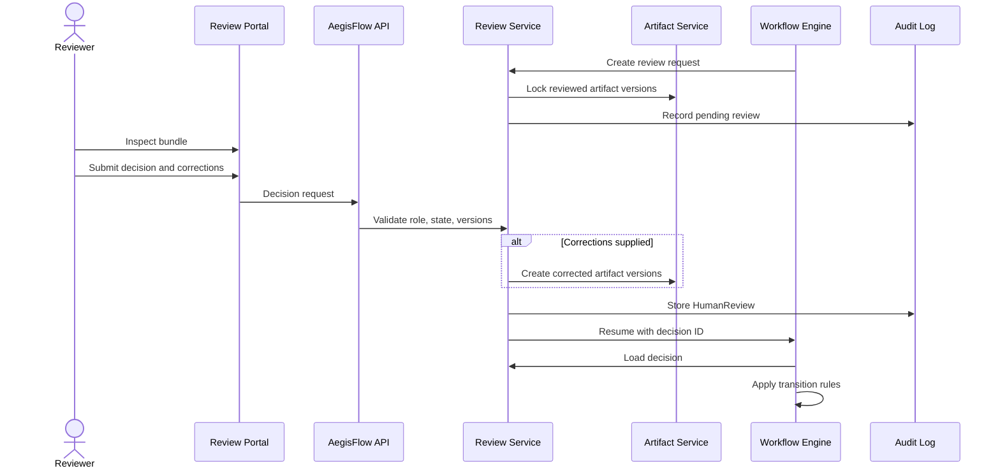

# Human-In-The-Loop

## Principle

Human approval is a domain primitive, not a UI afterthought. AegisFlow must pause the workflow at defined gates and resume from the same point after a valid decision. Human intervention creates auditable events and, when corrections are made, new artifact versions.

## Technical Review Gate

The technical review bundle contains:

- Requirement Analysis artifact version.
- Architecture Analysis artifact version.
- System Analysis artifact version.
- Agent execution summaries and confidence values.
- Open questions, assumptions, and risks.
- Source citations used by agents.

Allowed decisions:

```text
APPROVE
APPROVE_WITH_CHANGE
REJECT
REQUEST_CLARIFICATION
```

Decision behavior:

| Decision | Workflow Result |
|---|---|
| `APPROVE` | Continue to `ESTIMATION` using reviewed artifact versions |
| `APPROVE_WITH_CHANGE` | Create corrected artifact versions, then continue to `ESTIMATION` |
| `REJECT` | Return to `BRD_SUBMITTED` or terminate project according to policy |
| `REQUEST_CLARIFICATION` | Return to `REQUIREMENT_ANALYSIS` or `BRD_SUBMITTED` depending on missing source |

## PM Review Gate

The PM review bundle contains:

- Estimation artifact version.
- Jira Planning artifact version.
- Scope assumptions and unknowns.
- Draft epic/story/task hierarchy.

Allowed decisions:

```text
APPROVE
APPROVE_WITH_CHANGE
REJECT
```

Decision behavior:

| Decision | Workflow Result |
|---|---|
| `APPROVE` | Continue to Jira creation |
| `APPROVE_WITH_CHANGE` | Create corrected estimation or Jira draft versions, then continue to Jira creation |
| `REJECT` | Return to `ESTIMATION` or `JIRA_DRAFT` based on rejection reason |

## Human Approval Sequence



## Review Model

```yaml
humanReview:
  reviewId: rev-001
  projectId: PRJ-001
  gate: TECHNICAL_REVIEW
  status: COMPLETED
  requestedRoles:
    - ARCHITECT
    - SYSTEM_ANALYST
  reviewedArtifactVersions:
    architecture: 4
    systemAnalysis: 3
    requirementAnalysis: 2
  decision: APPROVE_WITH_CHANGE
  decisionReason: "Use existing payment orchestration service instead of new service."
  correctionArtifactVersions:
    architecture: 5
  reviewerId: user-architect-001
  decidedAt: 2026-09-12T11:00:00+07:00
```

## Resumability Rules

- A review is tied to exact artifact versions.
- If any reviewed artifact is superseded while review is pending, the review becomes `STALE`.
- A stale review cannot resume the workflow.
- Workflow resume payload references only `reviewId`; the workflow loads the decision from the database.
- Review decisions are idempotent.

## Governance Rules

- Human corrections are not hidden edits; they produce new versions.
- Approval can be role-based and multi-party in later phases.
- Security-sensitive decisions require explicit role authorization.
- PM approval is required before Jira creation even if agent confidence is high.
- Technical approval is required before estimation because architecture changes affect effort.

## Future Extension

Future gates can be added for:

- Security review.
- Data governance review.
- Architecture Review Board.
- Production readiness.
- QA/UAT sign-off.
