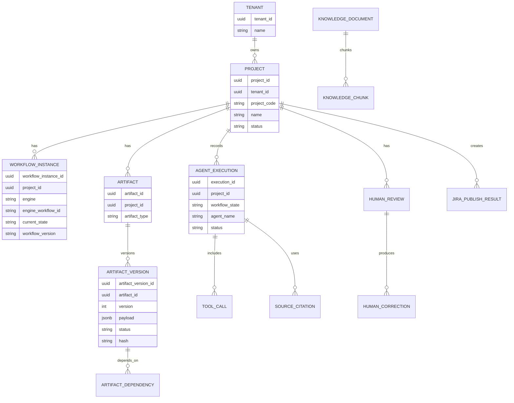

# Data Model

## Persistence Strategy

Use PostgreSQL as the authoritative data store for MVP. Store structured JSON artifacts in relational tables with JSONB payloads, version metadata, hashes, and validation status. This gives flexibility during architecture discovery without prematurely freezing every artifact field into normalized tables.

Use pgvector only for curated knowledge embeddings and retrieval metadata when knowledge ingestion is introduced. Do not store authoritative enterprise records only as vectors.

## Conceptual ERD



## Core Tables

### `projects`

- `project_id`
- `tenant_id`
- `project_code`
- `name`
- `status`
- `created_by`
- `created_at`
- `updated_at`

### `workflow_instances`

- `workflow_instance_id`
- `project_id`
- `engine`
- `engine_workflow_id`
- `workflow_definition_version`
- `current_state`
- `state_entered_at`
- `pending_review_id`
- `status`
- `last_error_code`
- `created_at`
- `updated_at`

### `artifact_versions`

- `artifact_version_id`
- `artifact_id`
- `project_id`
- `artifact_type`
- `version`
- `payload`
- `schema_id`
- `schema_version`
- `status`
- `hash`
- `parent_artifact_version_id`
- `produced_by_type`
- `produced_by_id`
- `created_at`

### `artifact_dependencies`

- `artifact_version_id`
- `depends_on_artifact_version_id`
- `dependency_type`

### `agent_executions`

Required fields:

```text
executionId
projectId
workflowState
agentName
agentVersion
promptVersion
model
inputArtifactVersions
startedAt
completedAt
status
output
confidence
sources
toolCalls
tokenUsage
cost
humanDecision
humanCorrection
```

Recommended fields:

- `execution_id`
- `tenant_id`
- `project_id`
- `workflow_state`
- `agent_name`
- `agent_version`
- `prompt_version`
- `model_provider`
- `model`
- `model_parameters`
- `input_artifact_versions` JSONB
- `knowledge_snapshot_id`
- `started_at`
- `completed_at`
- `status`
- `output_artifact_version_id`
- `raw_output_ref`
- `validated_output` JSONB
- `confidence`
- `sources` JSONB
- `tool_calls` JSONB
- `token_usage` JSONB
- `cost_amount`
- `cost_currency`
- `trace_id`
- `error_code`
- `error_message`
- `human_decision_id`
- `human_correction_summary`

## AgentExecution JSON Example

```json
{
  "executionId": "exec-001",
  "projectId": "PRJ-001",
  "workflowState": "ARCHITECTURE_ANALYSIS",
  "agentName": "ArchitectureAgent",
  "agentVersion": "1.0.0",
  "promptVersion": "architecture-agent@2026.09.12",
  "model": "gpt-5",
  "inputArtifactVersions": {
    "brd": 3,
    "requirementAnalysis": 2
  },
  "startedAt": "2026-09-12T10:00:00+07:00",
  "completedAt": "2026-09-12T10:02:31+07:00",
  "status": "SUCCEEDED",
  "output": {
    "artifactType": "ARCHITECTURE_ANALYSIS",
    "version": 4,
    "hash": "sha256:..."
  },
  "confidence": 0.83,
  "sources": [
    {
      "sourceId": "svc-catalog-payment-orchestration",
      "authority": "AUTHORITATIVE",
      "retrievedAt": "2026-09-12T10:00:30+07:00"
    }
  ],
  "toolCalls": [],
  "tokenUsage": {
    "inputTokens": 12000,
    "outputTokens": 2600
  },
  "cost": {
    "amount": 0.42,
    "currency": "USD"
  },
  "humanDecision": null,
  "humanCorrection": null
}
```

## Audit Log

Audit records must be append-only and include:

- Actor type: human, workflow, agent, system.
- Actor ID.
- Project ID and tenant ID.
- Action.
- Entity type and entity ID.
- Before and after hashes where applicable.
- Timestamp.
- Request ID and correlation ID.
- Source IP or service identity where applicable.

## Metrics Enabled By The Model

- Human approval rate.
- Human correction rate.
- Architecture recommendation acceptance rate.
- Requirement issue detection accuracy.
- Estimation accuracy after actual delivery data is integrated.
- Jira correction rate.
- Agent cost and latency.
- Tool failure rate.
- Knowledge source usage and source acceptance.
