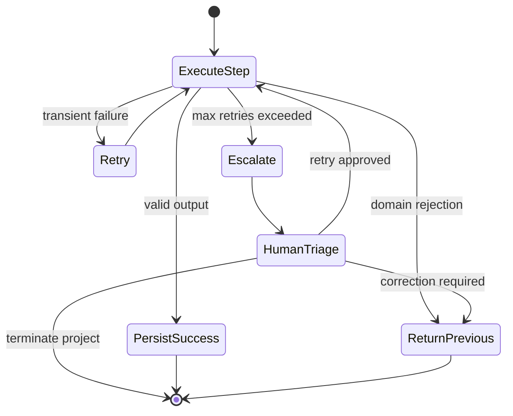

# Failure Handling

## Failure Strategy

Failure handling must be explicit per workflow state. The workflow engine retries technical failures according to policy, but domain failures are represented as structured outcomes and routed through transition rules.

## Failure Matrix

| Failure | Default Action | Notes |
|---|---|---|
| Agent timeout | `RETRY`, then `ESCALATE_TO_HUMAN` | Retry with same input versions and idempotency key |
| Agent produces invalid output | `RETRY`, then `ESCALATE_TO_HUMAN` | Include schema errors in execution record |
| LLM unavailable | `WAIT`, then `RETRY`, then `ESCALATE_TO_HUMAN` | Avoid switching model without policy approval |
| Tool unavailable | `RETRY` for transient, `ESCALATE_TO_HUMAN` for required source | Mark unavailable source in artifact |
| Human rejects recommendation | `RETURN_TO_PREVIOUS_STATE` or terminate | Based on gate and rejection reason |
| BRD changes during analysis | `RETURN_TO_PREVIOUS_STATE` | Mark downstream artifacts stale |
| Architecture changes after estimation | `RETURN_TO_PREVIOUS_STATE` to `ESTIMATION` | Estimation and Jira draft become stale |
| Jira API failure | `RETRY`, then `WAIT` or `ESCALATE_TO_HUMAN` | Do not create duplicate tickets |
| Duplicate workflow execution | `WAIT` or no-op | Detect by workflow idempotency key |
| Partial workflow failure | `WAIT` or compensating state | Persist completed artifact versions; do not delete |

## Retry Policy

Recommended defaults:

- Agent execution timeout: bounded per agent.
- Agent invalid output retries: maximum 2.
- External read retries: exponential backoff, maximum 3.
- External write retries: idempotent retries only.
- Human wait: no timeout by default; escalation reminders may be scheduled.

## Rollback Position

Prefer forward correction over destructive rollback:

- Keep generated artifacts.
- Mark superseded or rejected.
- Create new versions.
- Record decision and reason.

Rollback should only mean returning workflow control to a previous state, not deleting history.

## Stale Artifact Handling

If a source artifact changes:

| Changed Artifact | Stale Downstream Artifacts |
|---|---|
| BRD | All downstream analysis, estimation, Jira draft |
| BRD Intake | Requirement, architecture, system, estimation, Jira |
| Requirement Analysis | Architecture, system, estimation, Jira |
| Architecture Analysis | System, estimation, Jira |
| System Analysis | Estimation, Jira |
| Estimation | Jira |

## Invalid Agent Output

Invalid output includes:

- JSON schema violation.
- Unsupported enum.
- Missing required citations.
- Unsafe tool request.
- Output exceeding size limits.
- Contradictory structured fields.

The workflow must not transition on invalid output. Persist the failed execution for audit and either retry or escalate.

## Human Rejection Handling

Human rejection must include a structured reason:

```text
BRD_INCOMPLETE
ARCHITECTURE_UNACCEPTABLE
EXISTING_CAPABILITY_MISSED
SECURITY_RISK
ESTIMATION_UNRELIABLE
JIRA_PLAN_INCORRECT
OTHER
```

The reason determines whether the workflow returns to BRD submission, requirement analysis, architecture analysis, estimation, or Jira draft.

## Duplicate Protection

- Use deterministic workflow IDs.
- Enforce unique constraints on active workflow per project/BRD version.
- Use idempotency keys for agent execution and Jira publishing.
- Store external correlation IDs.

## Failure State Machine


