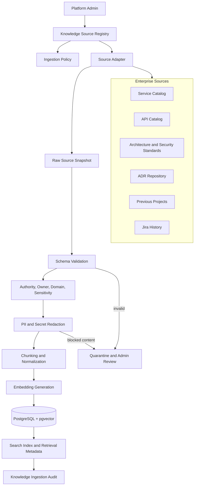
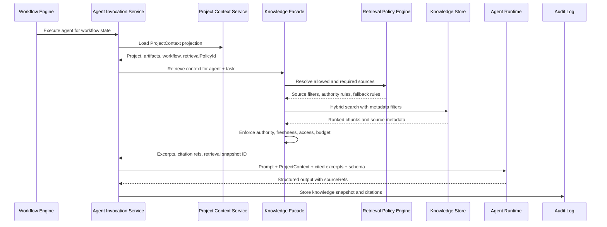
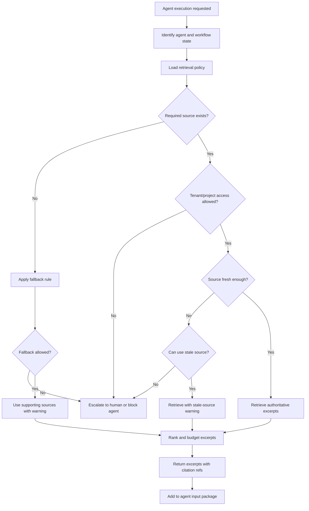

# Knowledge Source Design

## Purpose

The Knowledge source layer is the governed retrieval system behind AegisFlow agents. It lets agents use enterprise context without giving them direct, uncontrolled access to enterprise systems.

A knowledge source is not just a document store. It is a registered, permissioned, freshness-scored source of evidence that can be cited in agent outputs and audited later.

The layer answers four questions:

- Which enterprise sources are available?
- Which sources are authoritative, supporting, stale, or unavailable?
- Which agents may use each source?
- Which exact excerpts were used to produce an artifact?

## Core Model

```text
Enterprise source
  -> Knowledge source registry
  -> Ingestion or read-only adapter
  -> Knowledge documents
  -> Knowledge chunks
  -> Retrieval policy
  -> Agent input package
  -> Source citations in agent output
```

The authoritative record remains in the source system when possible. AegisFlow stores retrieval metadata, source snapshots, chunks, embeddings, citations, and audit records. It must not treat vector embeddings as the only copy of an authoritative enterprise record.

## Relationship To RAG

The Knowledge source layer is a governed Retrieval-Augmented Generation, or RAG, subsystem. It should not be implemented as a generic "chat with documents" feature where every agent can search every indexed source. In AegisFlow, retrieval is controlled by workflow state, agent identity, source authority, freshness, access policy, and citation requirements.

At a technical level, the RAG pipeline is:

```text
Source registry
  -> ingestion
  -> validation and redaction
  -> chunking and normalization
  -> embedding generation
  -> vector and metadata storage
  -> retrieval policy enforcement
  -> agent context package
  -> cited structured output
```

This means AegisFlow likely needs a RAG implementation, but it should live behind the Knowledge Facade or Governed Retrieval Layer. Agents should not call a vector database directly. They ask AegisFlow for allowed knowledge, and the Knowledge Facade decides what can be retrieved.

The RAG implementation must support:

- metadata filtering by tenant, project, source type, domain, authority, freshness, and allowed agent;
- semantic similarity search over curated chunks;
- source ranking that combines vector similarity with authority and freshness;
- deterministic retrieval budgets per agent and workflow state;
- source citations returned with every excerpt;
- replayable retrieval snapshots for audit and human review;
- exclusion of stale, unauthorized, quarantined, or unverified content.

The distinction is important:

| Generic RAG | AegisFlow governed RAG |
|---|---|
| User or agent searches any indexed content | Retrieval policy decides allowed sources |
| Similarity score is often the main ranking signal | Similarity is blended with authority, freshness, access, and agent need |
| Citations may be optional | Citations are required for governed artifacts |
| Chat history can influence context | `ProjectContext` and artifact versions are canonical |
| Missing source may silently reduce quality | Required source failure can block or escalate execution |
| Vector store may be treated as the knowledge base | Source systems remain authoritative; vectors are retrieval aids |

Example: the Architecture Agent may be required to retrieve from Service Catalog and Architecture Standards before proposing a new service. The Jira Planning Agent, however, may be restricted to approved artifacts and Jira configuration, with no free retrieval from enterprise catalogs unless the retrieval policy explicitly allows it.

## Source Types

| Source | Default authority | Typical use |
|---|---:|---|
| Service Catalog | Authoritative | Existing service reuse, ownership, capability lookup |
| API Catalog | Authoritative | API contract discovery and integration feasibility |
| Database Catalog | Authoritative | Data ownership, system of record, sensitive fields |
| Event Catalog | Authoritative | Async integration, event topics, producers and consumers |
| Architecture Standards | Authoritative | Approved patterns, service boundary rules, integration standards |
| Security Standards | Authoritative | PII, secrets, compliance, access restrictions |
| ADR Repository | Authoritative within scope | Prior architecture decisions and superseded decisions |
| Previous Projects | Supporting | Precedent, estimation hints, implementation lessons |
| Jira History | Supporting | Delivery history and estimation calibration |
| Source Repository | Supporting or authoritative | Existing APIs, code ownership, implementation evidence |
| Observability | Supporting | Runtime capacity, reliability, latency assumptions |

## Ingestion Flow



### Ingestion Steps

1. Register the source.

   Store `sourceId`, `sourceType`, owner, owning system, authority level, enabled state, allowed agents, sync mode, freshness SLA, and sensitivity policy.

2. Pull or receive source data.

   Use a read-only API when the enterprise system is authoritative and queryable. Use cached ingestion for previous projects, ADRs, standards, and exported files.

3. Validate schema and ownership.

   Every record must have enough metadata to be useful: title, source system ID, owner, effective date or version, authority, access scope, and freshness timestamp.

4. Classify and protect content.

   Mark authority, domain, confidentiality, PII, secrets, and project/tenant access. Redact sensitive fields before retrieval when possible.

5. Normalize into documents and chunks.

   Store a `KnowledgeDocument` per source record and `KnowledgeChunk` rows for searchable excerpts. Chunks must keep references back to the source record and version.

6. Generate embeddings for curated chunks.

   Store vectors in pgvector for semantic retrieval. Keep structured metadata in PostgreSQL so retrieval can filter by agent, authority, tenant, domain, freshness, and source type.

7. Publish retrieval metadata.

   Make the source available only after validation succeeds. Failed or stale ingestion does not silently disappear; it appears in the Knowledge UI as unavailable, stale, or quarantined.

8. Audit the ingestion.

   Record who configured the source, which adapter ran, how many documents changed, validation failures, redactions, and the resulting index version.

## Runtime Retrieval Flow



The agent receives excerpts, not open-ended access to every source. The `retrievalPolicyId` in `ProjectContext` determines what can be used for that workflow state and agent.

## Retrieval Decision Process



## Which Sources Each Agent Should Use

| Agent | Required sources | Optional sources | Sources to avoid by default |
|---|---|---|---|
| BRD Intake Agent | Current BRD artifact | Business glossary, product taxonomy | Previous projects unless explicitly requested |
| Requirement Analyst Agent | Current BRD, business glossary, security standards where applicable | Previous projects, incident patterns, SLA standards | Source repository code |
| Architecture Agent | Service Catalog, API Catalog, Architecture Standards | Database Catalog, Event Catalog, ADRs, Source Repository, Previous Projects | Jira delivery history as a primary architecture source |
| System Analyst Agent | API Catalog, Database Catalog, Event Catalog, approved Architecture Analysis | Service Catalog, Security Standards, Observability | Previous projects as authoritative contract source |
| Estimation Agent | Approved Requirement/Architecture/System artifacts | Jira History, Previous Projects, team velocity data | Architecture standards as estimation evidence unless tied to complexity |
| Jira Planning Agent | Approved analysis artifacts, Jira project configuration | Previous Jira examples, component mapping catalog | Raw enterprise catalogs unless needed for labels/components |
| Future Development Agent | Approved Jira task, Source Repository, coding standards | API Catalog, ADRs, CI quality rules | Unapproved BRD or draft analysis artifacts |
| Future QA Agent | Acceptance criteria, API contracts, test standards | Incident history, observability, previous defects | Unsupported previous-project assumptions |

## Source Selection Rules

### 1. Workflow State Comes First

Agents can only retrieve sources relevant to their current workflow state. For example, the Jira Planning Agent should use approved analysis artifacts, not draft analysis that is still waiting for technical review.

### 2. Required Sources Can Block Execution

If the Architecture Agent cannot access the Service Catalog or Architecture Standards, it should not confidently propose a new service. The output should be blocked or marked as needing human review, depending on policy.

### 3. Authoritative Beats Supporting

When sources conflict:

```text
Authoritative current source
  > authoritative stale source
  > scoped ADR
  > previous project
  > Jira history
  > unverified upload
```

Supporting sources may add context, but they must not override the current BRD, approved artifact versions, or enterprise catalogs.

### 4. Freshness Is Agent-Specific

Different agents need different freshness thresholds:

| Source | Architecture Agent | System Analyst Agent | Estimation Agent |
|---|---:|---:|---:|
| Service Catalog | 24 hours | 24 hours | 7 days |
| API Catalog | 24 hours | 12 hours | 7 days |
| Architecture Standards | 30 days | 30 days | 90 days |
| Jira History | 30 days | Not required | 7 days |
| Previous Projects | 90 days | 90 days | 180 days |

### 5. Retrieval Must Be Reproducible

Every agent execution should store:

- `knowledgeSnapshotId`
- source IDs and versions
- retrieval policy ID and version
- query text or structured retrieval request
- returned chunk IDs
- authority and freshness metadata
- citations used in the final output

This allows humans to replay why the agent made a recommendation.

## Retrieval Policy Shape

Example policy for the Architecture Agent:

```yaml
retrievalPolicy:
  policyId: kp-architecture-mvp
  agentName: ArchitectureAgent
  workflowStates:
    - ARCHITECTURE_ANALYSIS
  requiredSources:
    - sourceType: Service Catalog
      minAuthority: AUTHORITATIVE
      maxAgeHours: 24
      onUnavailable: BLOCK_AGENT
    - sourceType: Architecture Standards
      minAuthority: AUTHORITATIVE
      maxAgeHours: 720
      onUnavailable: ESCALATE_TO_HUMAN
  optionalSources:
    - sourceType: API Catalog
      maxAgeHours: 24
    - sourceType: Database Catalog
      maxAgeHours: 24
    - sourceType: Event Catalog
      maxAgeHours: 24
    - sourceType: ADR Repository
      excludeSuperseded: true
    - sourceType: Previous Projects
      maxResults: 3
      authority: SUPPORTING
  citationRules:
    mustCiteAuthoritativeSources: true
    minCitationsForNewServiceRecommendation: 2
    requireConflictDisclosure: true
  retrievalBudget:
    maxChunks: 20
    maxTokens: 8000
```

## Retrieval Scoring

AegisFlow should rank candidate chunks with a blended score:

```text
finalScore =
  semanticSimilarity
  + authorityBoost
  + freshnessBoost
  + projectDomainBoost
  + sourceTypeBoostForAgent
  - accessPenalty
  - stalenessPenalty
  - duplicatePenalty
```

The ranking should be explainable. The Knowledge screen should show why a source was used: matched domain, required by policy, high-authority source, recent sync, or project-specific relevance.

## Data Objects

### `knowledge_source_registry`

Stores source configuration.

```text
source_id
source_type
owning_system
owner_team
authority
enabled
allowed_agents
sync_mode
freshness_sla
sensitivity_policy
last_ingested_at
last_status
```

### `knowledge_documents`

Stores document or record snapshots.

```text
document_id
source_id
external_record_id
title
version
effective_date
authority
owner
hash
status
metadata
```

### `knowledge_chunks`

Stores searchable excerpts.

```text
chunk_id
document_id
source_id
text
embedding
chunk_type
access_scope
metadata
hash
```

### `retrieval_policies`

Stores per-agent retrieval rules.

```text
policy_id
agent_name
workflow_state
required_sources
optional_sources
fallback_behavior
citation_rules
retrieval_budget
version
```

### `source_citations`

Stores which sources were used by agent outputs.

```text
citation_id
execution_id
project_id
artifact_version_id
source_id
document_id
chunk_id
authority
retrieved_at
excerpt_ref
```

## Human Governance

The Knowledge UI should let administrators and reviewers:

- enable or disable a source;
- change authority level;
- set owner and freshness SLA;
- configure allowed agents;
- trigger reindexing;
- inspect failed ingestion;
- inspect which agent executions cited the source;
- see stale-source warnings;
- quarantine unsafe or invalid records.

Human reviewers should see source citations inside generated artifacts. If a recommendation depends only on supporting or stale sources, the review UI should make that visible.

## Failure Behavior

| Failure | System behavior |
|---|---|
| Required authoritative source unavailable | Block agent or escalate to human based on policy |
| Optional source unavailable | Continue and record missing optional source |
| Source stale | Warn, block, or allow depending on source type and agent |
| Schema validation failure | Quarantine record and exclude from retrieval |
| PII or secret detected | Redact or quarantine before indexing |
| Conflicting authoritative sources | Return both and require conflict disclosure |
| Access denied | Exclude source and audit access decision |

## Minimal MVP

For MVP, start with:

1. `knowledge_source_registry`
2. manual upload or read-only adapters for Architecture Standards, Service Catalog, and API Catalog
3. cached ingestion into `knowledge_documents` and `knowledge_chunks`
4. pgvector retrieval for curated chunks
5. retrieval policies for Requirement Analyst, Architecture Agent, and System Analyst
6. source citations persisted on `agent_executions`
7. Knowledge UI showing authority, freshness, allowed agents, and citation usage

The important boundary is that agents never choose arbitrary enterprise systems themselves. The workflow and retrieval policy decide what is available; the Knowledge Facade retrieves the allowed evidence; the agent must cite what it used.
