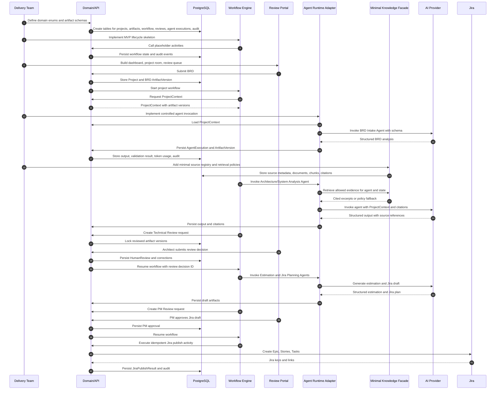
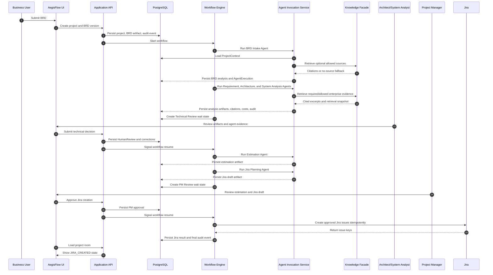

# Implementation Process Flow

## Purpose

This document explains the practical build order for AegisFlow: what must exist first, what can be deferred, and how the MVP should be assembled without accidentally building a large knowledge platform before the core workflow is proven.

The short answer:

```text
Do not build the full Knowledge component first.
Build the deterministic workflow and artifact spine first.
Add a minimal Knowledge Facade before agents that depend on enterprise evidence.
Expand knowledge ingestion after the MVP workflow is working end to end.
```

## Build Principle

AegisFlow is not primarily a document chat system. It is a governed workflow system that uses agents at controlled lifecycle steps.

Therefore, the first implementation priority is the governance spine:

```text
Project
  -> BRD artifact version
  -> ProjectContext
  -> workflow state
  -> agent execution record
  -> human review
  -> approved artifact
  -> Jira draft
  -> PM approval
  -> Jira creation
```

The Knowledge component supports better agent output, but it should not become the first blocking subsystem unless the MVP explicitly requires authoritative Service Catalog, API Catalog, or Architecture Standards lookup from day one.

## Prerequisites

Before implementation starts, the team should agree on these decisions.

| Area | Required Decision | Why It Matters |
|---|---|---|
| MVP lifecycle | Confirm states from `BRD_SUBMITTED` to `JIRA_CREATED` | Prevents workflow churn during implementation |
| Roles | Business, Architect, System Analyst, PM, Admin | Controls approval gates and UI permissions |
| Artifact schemas | BRD analysis, requirement analysis, architecture analysis, system analysis, estimation, Jira draft | Agents need structured outputs from the start |
| Human decisions | `APPROVE`, `APPROVE_WITH_CHANGE`, `REJECT`, `REQUEST_CLARIFICATION` | Workflow resume depends on these values |
| Jira mapping | Epic, Story, Task fields and target Jira project | Required before Jira Planning Agent can produce useful drafts |
| Prompt versioning | Where prompts live and how versions are named | Required for reproducible agent executions |
| AI provider policy | Model choice, data retention, token budget, timeout | Required before invoking agents with enterprise data |
| Knowledge authority policy | Which sources are authoritative vs supporting | Required before agents cite enterprise evidence |

## Recommended Implementation Order

### Step 1: Domain And State Foundation

Implement the core domain objects and lifecycle enums first.

Build:

- `Project`
- `WorkflowInstance`
- `ArtifactVersion`
- `ProjectContext`
- `AgentExecution`
- `HumanReview`
- `AuditLog`

Outcome:

- The application can represent a project, its current lifecycle state, its artifact versions, and its audit history without any AI integration.

Why first:

- Agents and workflows need stable persistence contracts.
- Human review cannot be reliable if artifact versions are not immutable.
- Knowledge retrieval cannot be safely scoped without `ProjectContext`.

### Step 2: Persistence And API Skeleton

Create PostgreSQL migrations and basic API endpoints.

Build:

- Project creation endpoint.
- BRD upload or BRD text submission endpoint.
- Artifact version persistence.
- Project context projection.
- Audit write path.
- Basic read APIs for dashboard and project room.

Outcome:

- Users can submit a BRD and see a project record.
- The system can store canonical artifacts before any agent runs.

### Step 3: Workflow Skeleton

Implement the durable lifecycle workflow with placeholder activities.

Build:

- Workflow definition for the MVP states.
- State transition rules.
- Retry and timeout policy.
- Human wait states.
- Resume signal handling.
- Idempotency keys for workflow start and activity execution.

Outcome:

- A project can move through the lifecycle using stubbed activities.
- The workflow can pause at technical review and PM review, then resume.

Why before agents:

- The workflow must control agent execution, not the other way around.
- This proves resumability and human governance before adding LLM variability.

### Step 4: Review Portal And Human Gates

Implement the user-facing review flow before trying to optimize agents.

Build:

- Review queue.
- Project command room.
- Technical review decision form.
- PM review decision form.
- Correction capture.
- Reviewed artifact version locking.

Outcome:

- Humans can approve, approve with change, reject, or request clarification.
- The workflow resumes from the review decision without restarting.

Why early:

- Human approval is the control point that makes agent output safe to use.

### Step 5: Agent Runtime Adapter

Implement the bounded agent execution mechanism.

Build:

- Agent invocation service.
- Prompt registry and prompt version lookup.
- Structured input assembly from `ProjectContext`.
- JSON schema validation for outputs.
- Agent execution audit persistence.
- Token, cost, latency, source, and tool-call recording.

Outcome:

- The workflow can invoke an agent activity and persist a validated structured result.
- Invalid output does not change workflow state.

Important boundary:

- The agent runtime does not decide lifecycle transitions.
- The workflow and domain services evaluate validated structured values.

### Step 6: Minimal Knowledge Facade

Add the smallest useful knowledge capability before Architecture and System Analysis agents become dependent on enterprise evidence.

Build:

- `KnowledgeSearchPort` interface.
- Knowledge source registry.
- Manual or read-only source registration.
- Retrieval policy per agent and workflow state.
- Citation object model.
- Fallback behavior when knowledge is unavailable.

MVP can start with:

- Manually uploaded Architecture Standards.
- Manually uploaded Security Standards.
- Small Service Catalog export.
- Small API Catalog export.

Defer initially:

- Full enterprise catalog integrations.
- Continuous sync jobs.
- Advanced source freshness scoring.
- Large-scale pgvector tuning.
- Observability platform ingestion.
- Source repository analysis.

Outcome:

- Agents can request allowed evidence through the Knowledge Facade.
- The system can still run when knowledge is unavailable, if policy allows it.
- Required-source failures can block or escalate to human review.

Answer to the key question:

```text
The Knowledge component does not need to be fully implemented first.
But a minimal Knowledge Facade should exist before agents are allowed to make architecture recommendations that depend on existing services, APIs, standards, or catalogs.
```

### Step 7: Initial Agents

Implement agents in workflow order.

Recommended sequence:

1. BRD Intake Agent.
2. Requirement Analyst Agent.
3. Architecture Agent.
4. System Analyst Agent.
5. Estimation Agent.
6. Jira Planning Agent.

Why this order:

- Each downstream agent depends on upstream artifacts.
- Architecture and System Analysis should use the minimal Knowledge Facade.
- Estimation should use approved or review-ready analysis artifacts.
- Jira Planning should run only after technical review is approved.

### Step 8: Jira Draft And Publish Flow

Implement Jira planning as draft-first, publish-later.

Build:

- Jira draft artifact.
- Jira field mapping.
- Epic, Story, Task hierarchy preview.
- PM approval gate.
- Idempotent Jira create command.
- Jira publish result persistence.

Outcome:

- AegisFlow can generate Jira-ready planning output.
- Jira tickets are not created until PM approval.

### Step 9: Observability, Evaluation, And Cost Controls

Add operational controls before expanding autonomy.

Build:

- Workflow dashboards.
- Agent execution dashboards.
- Cost and token reports.
- Human correction capture.
- Prompt/model evaluation datasets.
- Failure and retry visibility.

Outcome:

- The team can measure approval rate, correction rate, latency, cost, and failure patterns.

### Step 10: Knowledge Maturity Expansion

After the MVP works end to end, mature the Knowledge component.

Add:

- Service Catalog adapter.
- API Catalog adapter.
- Database Catalog adapter.
- Event Catalog adapter.
- ADR repository ingestion.
- Previous project ingestion.
- pgvector retrieval for curated chunks.
- Source freshness scoring.
- Authority conflict handling.
- Knowledge admin UI.

Outcome:

- Agents become more context-aware without changing the workflow architecture.

## End-To-End Build Sequence Diagram



## Runtime Process Sequence Diagram

This is the process once the MVP is implemented.



## Dependency Map

| Component | Depends On | Can Be Stubbed? | Build Timing |
|---|---|---:|---|
| Domain model | Architecture decisions | No | First |
| PostgreSQL schema | Domain model | No | First |
| Workflow engine | State machine and domain services | Partially | Early |
| Review portal | Review model and workflow wait states | Partially | Early |
| Agent runtime adapter | ProjectContext and artifact schemas | No | Middle |
| Knowledge Facade | ProjectContext, retrieval policy, source registry | Yes | Middle |
| Full RAG with pgvector | Knowledge Facade and curated source data | Yes | Later |
| Initial agents | Agent runtime adapter and schemas | No | Middle |
| Jira integration | Jira mapping and PM approval | Partially | Late MVP |
| Evaluation datasets | AgentExecution and HumanCorrection | Yes | After agents |

## What To Build First In Practice

If the team needs a concrete sprint-level order, use this:

1. Define workflow states, artifact types, and decision enums.
2. Build database migrations for project, artifact, workflow, review, agent execution, and audit.
3. Build BRD submission and ProjectContext projection.
4. Build workflow skeleton with durable pause/resume.
5. Build dashboard, project room, and review queue.
6. Build agent invocation adapter with structured schema validation.
7. Build BRD Intake Agent and Requirement Analyst Agent.
8. Build minimal Knowledge Facade with manual Architecture Standards, Service Catalog, and API Catalog sources.
9. Build Architecture Agent and System Analyst Agent using the Knowledge Facade.
10. Build Technical Review gate.
11. Build Estimation Agent.
12. Build Jira Planning Agent and Jira draft artifact.
13. Build PM Review gate.
14. Build idempotent Jira creation.
15. Add observability, cost tracking, and evaluation reporting.

## Decision On Knowledge First

The Knowledge component should be treated as three layers:

| Layer | Needed Before MVP Agents? | Reason |
|---|---:|---|
| Knowledge interface/port | Yes | Agents need a stable way to request governed evidence |
| Minimal registry and manual/read-only sources | Yes, before Architecture/System Analysis | Prevents architecture recommendations from ignoring existing services and standards |
| Full enterprise RAG platform | No | It can mature after the workflow and review loop are proven |

The risky path is building a sophisticated RAG platform before the workflow spine exists. That would optimize retrieval before the system can prove governance, audit, approval, and Jira handoff.

The safer path is:

```text
Workflow spine first
  -> minimal governed knowledge
  -> initial agents
  -> human review loop
  -> Jira draft/publish
  -> knowledge maturity
```

## MVP Readiness Gate

The MVP is ready for implementation when these are true:

- The lifecycle states and transitions are approved.
- The first version of artifact schemas exists.
- The human approval decisions and permissions are approved.
- Jira mapping rules are known.
- Prompt versioning and model policy are agreed.
- Minimal knowledge source policy is agreed.
- Security review accepts the tool-access and data-handling model.

The MVP is not blocked by full enterprise knowledge integration. It is blocked only if no minimal source policy exists for agents that must make architecture or system-analysis claims.
