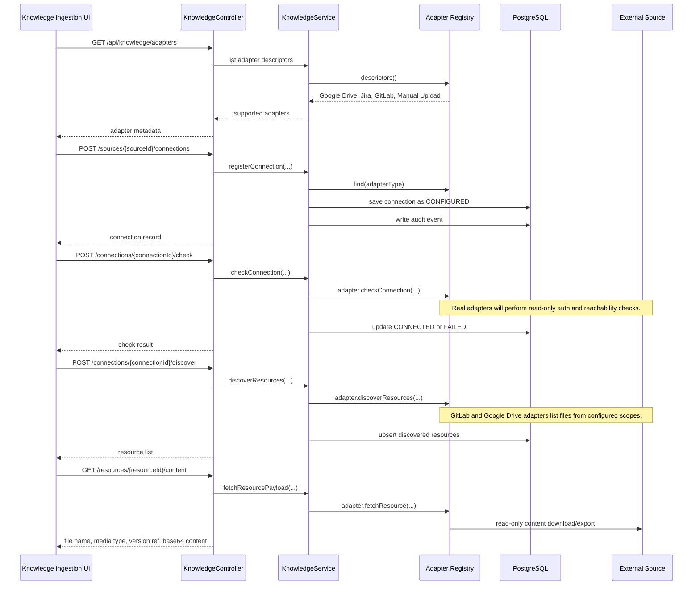

# Knowledge Source Adapters

`Register Source` in the Knowledge Ingestion screen should create two related records:

1. A governed knowledge source: ownership, authority, freshness SLA, allowed agents, workflow states, sensitivity policy, and tags.
2. One or more source connections: adapter type, resource locator, auth type, credential reference, connection status, and discovered resources.

AegisFlow must not store raw Google Drive, Jira, GitLab, or repository secrets in the knowledge tables. The backend stores only `credentialRef`, which should point to a future secrets manager entry.

## Current Backend Support

The API now exposes:

```text
GET  /api/knowledge/adapters
POST /api/knowledge/sources/{sourceId}/connections
GET  /api/knowledge/sources/{sourceId}/connections
GET  /api/knowledge/connections/{connectionId}
POST /api/knowledge/connections/{connectionId}/check
POST /api/knowledge/connections/{connectionId}/discover
GET  /api/knowledge/connections/{connectionId}/resources
GET  /api/knowledge/resources/{resourceId}/content
```

The first implementation validates and records connector configuration. GitLab and Google Drive now have read-only REST adapters for reachability checks, resource discovery, and resource content fetch. Full source-to-document ingestion is still a later sync workflow step.

## Adapter Flow



## Credential References

Current local implementation supports:

```text
env://VARIABLE_NAME
```

Example:

```text
credentialRef = env://AEGISFLOW_GITLAB_TOKEN
```

`vault://...` remains the recommended production shape, but it requires a future secrets manager adapter. AegisFlow should never store raw external tokens in `knowledge_source_connections`.

## GitLab Adapter

Adapter type:

```text
GITLAB
```

Required config:

```json
{
  "baseUrl": "https://gitlab.example.com",
  "projectPath": "group/platform-docs",
  "ref": "main",
  "path": "docs",
  "maxResources": "50"
}
```

Behavior:

- `check` calls the GitLab project endpoint.
- `discover` calls repository tree with `recursive=true`.
- `content` calls repository file raw content for the discovered path.
- `PAT` uses the `PRIVATE-TOKEN` header.
- `OAUTH` uses a bearer token.

## Google Drive Adapter

Adapter type:

```text
GOOGLE_DRIVE
```

Required config:

```json
{
  "folderId": "1abcDriveFolderId",
  "query": "mimeType != 'application/vnd.google-apps.folder'",
  "maxResources": "50"
}
```

Behavior:

- `check` lists one file from the configured folder.
- `discover` lists Drive files under the folder.
- `content` downloads binary files with `alt=media`.
- `content` exports Google Workspace Docs/Sheets/Slides to text-oriented formats.
- The token is supplied as a bearer token resolved from `credentialRef`.

## Why This Exists Before Real Connectors

The UI needs to support connector registration before source sync can become automatic. This keeps the ingestion process deterministic:

- The user registers a governed source.
- The user attaches a read-only adapter connection.
- The system validates whether the connection is usable.
- The system discovers resources before indexing them.
- Future sync workflows can fetch, store, index, quarantine, and audit external records without changing the UI contract.

## Next Implementation Step

Add a knowledge source sync workflow that converts fetched resource payloads into versioned knowledge documents:

- Fetch resource content through the adapter.
- Store the immutable source snapshot in MinIO.
- Extract text.
- Chunk and embed.
- Mark failed records as quarantined.
- Attach citation metadata to discovered resources.

All adapters must be read-only, scoped to an approved resource locator, and auditable per sync run.
