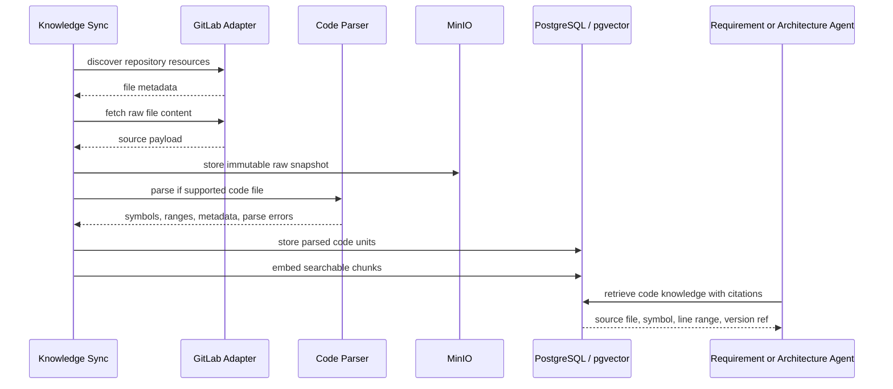

# GitLab Source Knowledge Parsing

## Question

Should AegisFlow add Tree-sitter for source knowledge retrieved from GitLab?

## Recommendation

Yes, but not as the first step for every GitLab resource.

Tree-sitter should be introduced when GitLab knowledge includes source code or code-adjacent files where structure matters, such as:

- Java/Kotlin/Go/TypeScript source files
- API controllers and route declarations
- domain models and DTOs
- repository interfaces
- configuration files
- test files
- infrastructure code
- SQL migrations

For plain Markdown, ADRs, runbooks, BRDs, README files, and general documentation, normal text extraction and chunking is enough. Tree-sitter adds value when AegisFlow needs symbol-level understanding rather than page-level text retrieval.

## Why Tree-sitter Helps

The current GitLab adapter can discover repository files and fetch raw content. Without a parser, AegisFlow treats source files mostly as text. That is useful, but limited.

Tree-sitter can parse source files into syntax trees and expose:

- node types, such as class, method, function, import, annotation, call expression, or field declaration;
- byte offsets and line ranges;
- named child nodes;
- language-specific query captures;
- stable structural chunks, such as one function, one class, or one endpoint handler.

This lets AegisFlow index code as structured knowledge instead of arbitrary text chunks.

## Target Outcome

For GitLab source knowledge, AegisFlow should eventually produce indexed knowledge units like:

```json
{
  "sourceId": "service-catalog",
  "repository": "payments/qris-service",
  "filePath": "src/main/java/com/company/qris/PaymentController.java",
  "language": "java",
  "symbolType": "controller_method",
  "symbolName": "createDynamicQr",
  "startLine": 42,
  "endLine": 91,
  "text": "...method source or normalized summary...",
  "metadata": {
    "httpMethod": "POST",
    "route": "/qris/dynamic",
    "owner": "Payments Platform",
    "versionRef": "main:abc123"
  }
}
```

This improves Requirement Analysis and Architecture Analysis because agents can answer questions like:

- Is there already an API that supports this requirement?
- Which controller or service owns this behavior?
- Which database or event contracts are referenced by the implementation?
- Which previous implementation pattern should be reused?
- Which files are likely impacted?

## Proposed Pipeline



## Processing Decision

Each GitLab file should go through a routing decision:

```text
GitLab file fetched
  |
  +-- Is binary or too large?
  |     -> store snapshot, skip indexing, mark unsupported
  |
  +-- Is documentation?
  |     -> text extraction + markdown-aware chunking
  |
  +-- Is supported source code?
  |     -> Tree-sitter parse + symbol-aware chunking
  |
  +-- Is config or SQL?
        -> parser if available, otherwise structured text chunking
```

## Where It Fits In Current Architecture

Current components:

```text
GitLabKnowledgeSourceAdapter
  -> discoverResources(...)
  -> fetchResource(...)

KnowledgeService.syncSource(...)
  -> fetch payload
  -> create or update KnowledgeDocument
  -> extract text
  -> chunk
  -> embed
```

Tree-sitter should not be placed inside `GitLabKnowledgeSourceAdapter`.

The adapter should remain responsible only for read-only GitLab access:

- check connection
- list files
- fetch file content

Parsing should be added behind a new ingestion component, for example:

```text
KnowledgeContentProcessor
  -> process(KnowledgeSourcePayload, KnowledgeSourceResource)

CodeKnowledgeParser
  -> parse(fileName, mediaType, content)

TreeSitterCodeKnowledgeParser
  -> language detection
  -> AST parse
  -> symbol extraction
  -> parse diagnostics
```

This keeps external source access separate from content understanding.

## Data Model Additions

The current `knowledge_documents` and `knowledge_chunks` tables are enough for plain text retrieval. Tree-sitter would benefit from a separate table for code-aware metadata.

Recommended table:

```text
knowledge_code_units

code_unit_id
document_id
document_version
source_id
connection_id
external_id
file_path
language
symbol_type
symbol_name
start_line
end_line
start_byte
end_byte
content_hash
text
metadata_json
created_at
```

The embedding can still live in `knowledge_chunks`, or we can create code chunks from `knowledge_code_units`.

Recommended approach for MVP evolution:

1. Store code units in `knowledge_code_units`.
2. Create normal `knowledge_chunks` from each code unit.
3. Preserve code metadata in citation text or a chunk metadata table later.

## Language Priority

Do not try to support every language immediately.

Start with the languages most likely to appear in AegisFlow enterprise repositories:

1. Java
2. Kotlin
3. Go
4. TypeScript / JavaScript
5. SQL
6. YAML

Java should likely be first because AegisFlow itself is using Spring Boot and many enterprise backend services are Java-based.

## Chunking Strategy

Tree-sitter should change chunking behavior for code.

Current text chunking:

```text
split large text into size-bounded chunks
```

Code-aware chunking:

```text
class declaration
  -> class-level chunk

method/function declaration
  -> method-level chunk

annotations/routes
  -> endpoint metadata

imports/package
  -> dependency metadata
```

Example code chunk:

```text
File: PaymentController.java
Symbol: createDynamicQr
Type: controller_method
Lines: 42-91

@PostMapping("/qris/dynamic")
public ResponseEntity<DynamicQrResponse> createDynamicQr(...)
```

This is much better for retrieval than an arbitrary 1,200-character slice.

## Agent Usage

Requirement Analysis should use code knowledge carefully.

Good use:

- identify existing capabilities;
- find previous implementation patterns;
- detect missing NFR questions based on existing timeout/retry/reversal logic;
- cite concrete source files as evidence.

Bad use:

- treating existing code as always correct;
- allowing source code to override approved architecture;
- assuming old implementation patterns are still recommended;
- exposing sensitive code unnecessarily to LLM prompts.

Architecture Analysis benefits more strongly from Tree-sitter than Requirement Analysis because architecture questions often need source-level evidence.

## Security Considerations

Source code is sensitive enterprise knowledge.

Tree-sitter does not remove the need for security controls:

- enforce repository allowlists;
- scope GitLab tokens read-only;
- respect `allowedAgents`;
- avoid indexing secrets;
- scan for credentials before embedding;
- quarantine suspicious files;
- do not send entire repositories to the LLM;
- retrieve only relevant code units;
- cite file path, version ref, and line range.

Additional secret detection should run before embedding. Tree-sitter can help by identifying string literals, annotations, config assignments, and import patterns, but it is not a secret scanner by itself.

## Failure Behavior

| Failure | Behavior |
|---|---|
| Unsupported language | Store raw snapshot; use plain text chunking if safe |
| Parse error | Store parse diagnostic; fall back to text chunking |
| File too large | Store snapshot; skip or summarize with size guard |
| Binary file | Store snapshot metadata only |
| Secret detected | Quarantine; do not embed |
| Grammar unavailable | Fall back to plain text chunking |

Parsing failures should not fail the entire source sync unless the source policy requires strict parsing.

## Current Implementation

AegisFlow now has the first Tree-sitter-backed code parsing layer.

Implemented components:

```text
CodeKnowledgeParser
CodeKnowledgeParserRegistry
CodeKnowledgeUnit
CodeRelationship
CodeRelationshipExtractor
TreeSitterGoCodeKnowledgeParser
```

Current behavior:

1. Knowledge ingestion stores the raw fetched file as a normal versioned `KnowledgeDocument`.
2. During indexing, `KnowledgeService` asks `CodeKnowledgeParserRegistry` whether the file has a code parser.
3. `.go` files are routed to `TreeSitterGoCodeKnowledgeParser`.
4. The Go parser extracts code units for:
   - `function_declaration`
   - `method_declaration`
   - `type_spec`
5. Each unit becomes an LLM-friendly knowledge chunk containing:
   - language
   - file name
   - symbol type
   - symbol name
   - line range
   - source text
6. `CodeRelationshipExtractor` can infer initial relationships across parsed units, such as type dependencies, interface method calls, and internal function calls.
7. Non-code files continue through the existing text chunker.

This means Go files retrieved from GitLab can already be indexed at symbol granularity without putting parsing logic into `GitLabKnowledgeSourceAdapter`.

## Next Implementation Order

1. Keep GitLab adapter focused on discovery and fetch.
2. Add routing by file type and size.
3. Add secret/PII pre-check before indexing.
4. Store `knowledge_code_units` for explicit code metadata persistence.
5. Add parser support for Java, Kotlin, TypeScript, SQL, and YAML.
6. Add code-specific retrieval filters, such as `language`, `symbolType`, `symbolName`, and `filePath`.
7. Add line-range citations in agent source references.

This keeps the architecture clean and avoids turning the GitLab adapter into a parser, indexer, and policy engine all at once.

## Final Answer

Tree-sitter is not mandatory for basic GitLab knowledge ingestion, but it is highly valuable once AegisFlow needs source-level understanding.

Use normal text extraction for documentation. Use Tree-sitter for source code where agents need symbols, APIs, dependencies, routes, ownership clues, line-level citations, and reusable implementation patterns.
