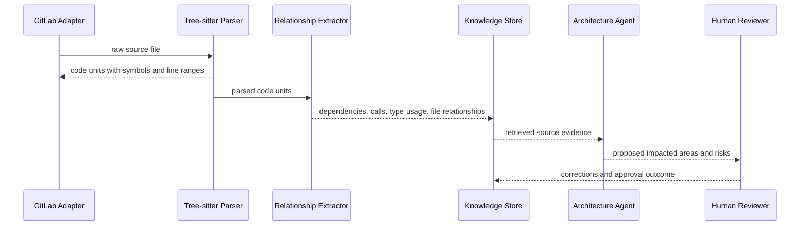
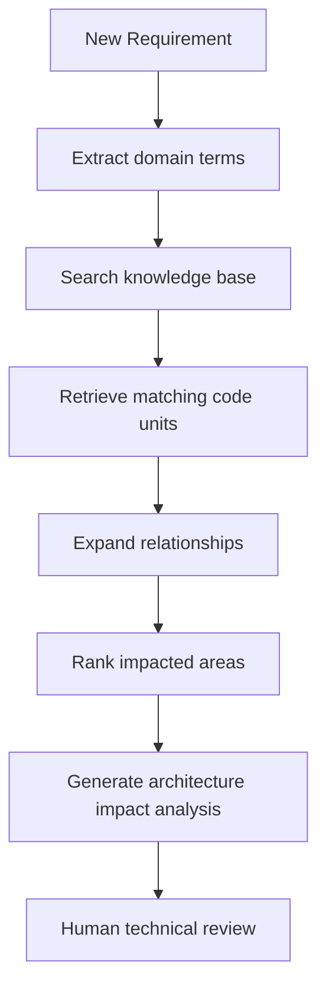

# Tree-sitter for Architecture Impact Analysis

## Purpose

This document refines how AegisFlow should use Tree-sitter to support LLM-assisted software architecture and requirement analysis.

The key question is:

```text
If a new feature is requested, can AegisFlow identify which systems, files, APIs, services, data models, and tests are likely impacted?
```

Short answer:

```text
Tree-sitter helps, but it is not sufficient alone.
```

Tree-sitter provides accurate source-code structure. AegisFlow must combine that structure with repository metadata, dependency inference, enterprise knowledge, historical project data, and LLM reasoning to produce useful impact analysis.

## Refined Position

Tree-sitter should be treated as a source-code structure extractor, not as the architecture analysis engine.

It is good at answering:

- What symbols exist in this file?
- What functions, methods, interfaces, structs, classes, or types are declared?
- Which function appears to call another function?
- Which type appears to depend on another type?
- Which imports are used?
- Which line range should be cited?
- Which code unit should become a retrieval chunk?

It is not enough to answer by itself:

- What business capability does this code support?
- Which system owns this feature?
- Whether an existing implementation is reusable or obsolete.
- Whether a change is architecturally acceptable.
- Whether a requirement should be implemented in this service or another service.
- Whether a detected dependency is runtime, build-time, historical, accidental, or architectural.

So the right model is:

```text
Tree-sitter
  -> extracts code structure

Code Relationship Extractor
  -> infers local relationships

Knowledge Graph / Metadata Store
  -> connects code to repositories, services, APIs, events, database tables, ADRs, Jira, incidents

Retriever
  -> selects relevant evidence

LLM Agent
  -> reasons over requirements and evidence

Human Reviewer
  -> approves, corrects, or rejects impact analysis
```

## Role in AegisFlow

Tree-sitter fits into the Knowledge Ingestion and Architecture Analysis flow.



## What Tree-sitter Enables

### 1. Symbol-Level Retrieval

Instead of indexing a whole source file as one text block, AegisFlow can index smaller units:

- one function
- one method
- one type
- one interface
- one controller handler
- one SQL migration block
- one configuration section

This helps the LLM receive precise evidence instead of large, noisy files.

Example:

```text
Requirement:
Add QR payment expiry reversal.

Retrieved code unit:
File: qris/service.go
Symbol: ReconcilePending
Lines: 52-70
Reason:
Existing pending-payment reconciliation logic already checks expiration.
```

### 2. Line-Level Citations

Tree-sitter gives byte and line ranges. That allows AegisFlow to cite code evidence precisely.

Better citation:

```text
qris/service.go:52-70 ReconcilePending
```

Weaker citation:

```text
qris/service.go
```

Line-level citation is important because humans need to review and trust the system’s recommendation.

### 3. Relationship Extraction

Tree-sitter allows AegisFlow to infer relationships such as:

```text
Service.CreateDynamicQr CALLS Repository.Save
Service DEPENDS_ON Repository
Controller.CreateQr CALLS Service.CreateDynamicQr
Service PUBLISHES payment.created
Repository IMPLEMENTED_BY PostgresRepository
```

The current implementation already starts this direction with:

```text
CodeKnowledgeUnit
CodeRelationship
CodeRelationshipExtractor
TreeSitterGoCodeKnowledgeParser
```

This is still an early relationship model. It should evolve from text-pattern inference into AST-query-based and language-aware inference.

### 4. Impact Radius Discovery

Once relationships are extracted, AegisFlow can expand impact analysis outward from initially matched code units.

Example:

```text
Initial match:
CreateDynamicQr

Relationship expansion:
CreateDynamicQr
  -> Repository.Save
  -> EventPublisher.Publish
  -> Payment
  -> PaymentCreated event
  -> ReconcilePending
  -> payment integration tests
```

This creates a likely impact radius for a requested feature.

### 5. Architecture Reuse Detection

The Architecture Agent should not immediately recommend new services. Tree-sitter helps detect existing capabilities:

```text
Existing function?
Existing interface?
Existing controller?
Existing repository?
Existing event publisher?
Existing validation path?
Existing retry/reconciliation logic?
```

This supports the AegisFlow principle:

```text
Investigate existing capability before proposing new components.
```

## New Feature Impact Analysis Flow

When a new BRD or requirement is submitted, AegisFlow should eventually perform impact analysis like this:



Detailed flow:

1. Extract requirement terms:
   - business capability
   - actors
   - entities
   - APIs
   - events
   - data objects
   - NFR terms

2. Retrieve candidate evidence:
   - code symbols
   - previous project documents
   - service catalog entries
   - API catalog entries
   - ADRs
   - Jira historical tickets

3. Expand from candidate code units:
   - caller/callee relationships
   - type dependencies
   - interface implementations
   - controller-to-service paths
   - repository/database access
   - event publishing/subscription paths
   - test coverage links

4. Rank likely impacted areas:
   - direct match to requirement terms
   - relationship distance from matched code
   - authoritative source quality
   - recency
   - service ownership
   - number of related changes in previous projects

5. Produce structured output:

```json
{
  "status": "IMPACT_ANALYSIS_READY",
  "confidence": 0.78,
  "impactedAreas": [
    {
      "type": "SERVICE",
      "name": "qris-service",
      "reason": "Existing QR payment creation and reconciliation logic found",
      "evidence": [
        {
          "file": "qris/service.go",
          "symbol": "CreateDynamicQr",
          "lines": "31-48"
        }
      ]
    }
  ],
  "unknowns": [
    "No source evidence found for reversal SLA handling"
  ],
  "recommendedHumanReview": true
}
```

## What “Impacted Area” Should Mean

An impacted area should not only mean “file that contains matching text.”

AegisFlow should classify impact across levels:

| Impact Level | Example |
|---|---|
| Business capability | Dynamic QR payment |
| Service | `qris-service` |
| API | `POST /qris/dynamic` |
| Code symbol | `CreateDynamicQr` |
| Data model | `Payment` |
| Database object | `payments` table |
| Event | `payment.created` |
| External integration | payment gateway |
| Test area | integration tests for expiry/reversal |
| Operational concern | timeout, retry, reconciliation, observability |

Tree-sitter mostly helps with code symbol, dependency, API, model, and event clues. Other levels require additional catalogs and metadata.

## Required Architecture Components

To turn Tree-sitter parsing into useful architecture impact analysis, AegisFlow needs these components.

### 1. Code Parser Layer

Already started:

```text
CodeKnowledgeParser
TreeSitterGoCodeKnowledgeParser
```

Future parsers:

```text
TreeSitterJavaCodeKnowledgeParser
TreeSitterKotlinCodeKnowledgeParser
TreeSitterTypeScriptCodeKnowledgeParser
TreeSitterSqlCodeKnowledgeParser
TreeSitterYamlCodeKnowledgeParser
```

### 2. Code Unit Store

Current state:

```text
Code units are converted into knowledge chunks.
```

Recommended next state:

```text
knowledge_code_units
```

Suggested fields:

```text
code_unit_id
source_id
document_id
document_version
repository
file_path
language
symbol_type
symbol_name
start_line
end_line
start_byte
end_byte
text
metadata_json
created_at
```

### 3. Relationship Store

Current state:

```text
CodeRelationshipExtractor infers relationships in memory.
```

Recommended next state:

```text
knowledge_code_relationships
```

Suggested fields:

```text
relationship_id
source_code_unit_id
target_code_unit_id
relationship_type
confidence
evidence
created_at
```

Relationship examples:

```text
CALLS_FUNCTION
CALLS_METHOD
CALLS_INTERFACE_METHOD
DEPENDS_ON_TYPE
IMPLEMENTS_INTERFACE
PUBLISHES_EVENT
CONSUMES_EVENT
READS_TABLE
WRITES_TABLE
EXPOSES_ENDPOINT
```

### 4. Impact Analyzer

Recommended component:

```text
CodeImpactAnalyzer
```

Responsibilities:

- accept requirement terms or initial code matches;
- retrieve matching code units;
- traverse relationships;
- rank impacted areas;
- produce structured impact evidence;
- pass evidence to the Architecture Agent.

### 5. Agent Contract Extension

Architecture Agent input should eventually include code impact evidence:

```json
{
  "requirementId": "REQ-001",
  "candidateImpacts": [
    {
      "service": "qris-service",
      "file": "qris/service.go",
      "symbol": "CreateDynamicQr",
      "relationshipPath": [
        "CreateDynamicQr",
        "Repository.Save",
        "Payment"
      ],
      "reason": "Requirement mentions QR payment creation and expiry"
    }
  ]
}
```

## How This Helps LLM Analysis

Tree-sitter improves LLM analysis by reducing ambiguity.

Without Tree-sitter:

```text
The LLM receives large source files or text chunks.
It must guess which functions matter.
It may miss relationships across files.
It may hallucinate code structure.
```

With Tree-sitter:

```text
The LLM receives selected symbols, line ranges, and inferred relationships.
It can reason over explicit evidence.
It can cite concrete files and symbols.
It is less likely to invent nonexistent methods or dependencies.
```

This is especially useful for:

- Architecture Agent
- System Analyst Agent
- Estimation Agent
- Code Review Agent later
- QA Agent later

## Limitations

Tree-sitter does not understand runtime behavior by itself.

It cannot reliably answer:

- whether a function is actually used in production;
- whether dependency injection binds an interface to a specific implementation;
- whether an event is consumed by another service;
- whether a database column is used indirectly;
- whether a feature flag changes execution behavior;
- whether a repository has dead code;
- whether a call is reachable in a given deployment.

Those require:

- build metadata;
- dependency injection analysis;
- runtime traces;
- service catalog;
- API gateway routes;
- event catalog;
- database catalog;
- observability data;
- human review.

## Confidence Model

Impact analysis should attach confidence by evidence quality.

High confidence:

- direct symbol match;
- explicit call relationship;
- explicit type dependency;
- direct API route match;
- cited line range.

Medium confidence:

- naming similarity;
- indirect relationship;
- previous project similarity;
- matching tags or comments.

Low confidence:

- fuzzy keyword match only;
- no code evidence;
- stale source;
- generated or incomplete code.

The LLM should not make automatic workflow decisions based only on low-confidence impact analysis.

## Recommended Next Steps

1. Keep Tree-sitter out of source adapters.
2. Persist `CodeKnowledgeUnit` records instead of only converting them to chunks.
3. Persist `CodeRelationship` records.
4. Add a `CodeImpactAnalyzer`.
5. Start with Go support because it is already implemented.
6. Add Java next because AegisFlow and many enterprise services use Java/Spring.
7. Feed impact evidence into Architecture Agent output.
8. Require human technical review before accepting impact analysis as authoritative.

## Conclusion

Implementing Tree-sitter does facilitate LLM analysis of software architecture requirements, but only when used as part of a larger evidence pipeline.

The refined architecture is:

```text
Tree-sitter parses code.
Relationship extractor connects code units.
Impact analyzer ranks likely affected areas.
LLM explains implications and gaps.
Human reviewer approves or corrects the result.
```

For new feature analysis, this can help AegisFlow identify likely impacted files, APIs, services, types, events, and tests. However, the output should remain advisory until validated by deterministic source metadata and human review.
